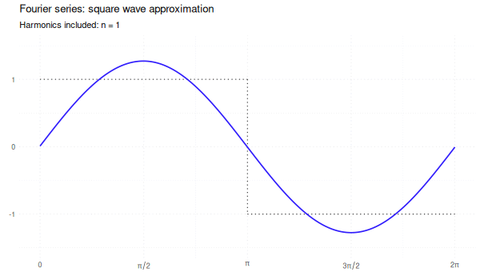

<!-- README.md is generated from README.Rmd. Please edit that file -->

```{r setup, include = FALSE}
knitr::opts_chunk$set(
  collapse = TRUE,
  comment = "#>",
  fig.path = "man/figures/README-",
  out.width = "100%",
  fig.align = "center",
  fig.height = 3,
  dev = "ragg_png",
  dpi = 132
)
```

# ggpointless


<!-- badges: start -->
[](https://CRAN.R-project.org/package=ggpointless)
[](https://github.com/flrd/ggpointless/actions/workflows/R-CMD-check.yaml)
)
[](https://app.codecov.io/gh/flrd/ggpointless)
<!-- badges: end -->

`ggpointless` is an extension of the [`ggplot2`](https://ggplot2.tidyverse.org/) package providing additional layers.

## Installation

You can install `ggpointless` from CRAN with:

```{r eval=FALSE}
install.packages("ggpointless")
# or devtools::install_github("flrd/ggpointless") for development version
```

## What will you get
This package is a collection of geoms and stats for [ggplot2](https://ggplot2.tidyverse.org/). The following functions are implemented:

- `geom_arch()` & `stat_arch()` -- draws a [catenary arch](https://en.wikipedia.org/wiki/Catenary_arch)
- `geom_area_fade()` -- area plots with a gradient fill
- `geom_catenary()` & `stat_catenary()` -- draws a [catenary curve](https://en.wikipedia.org/wiki/Catenary)
- `geom_chaikin()` & `stat_chaikin()` -- applies Chaikin's corner cutting algorithm
- `geom_fourier()` & `stat_fourier()` -- fits a Fourier series to `x`/`y` and renders the reconstructed curve
- `geom_lexis()` & `stat_lexis()` -- draws a Lexis diagram
- `geom_point_glow()` -- adds a radial gradient to your point plots
- `geom_pointless()` & `stat_pointless()` -- emphasises some observations with points

See [`vignette("ggpointless")`](https://flrd.github.io/ggpointless/articles/ggpointless.html)
for details and examples.

#### Set theme up

```{r theme-setup}
library(ggpointless)

roma <- scico::scico(4, palette = "roma")
theme_set(
  theme_minimal() +
    theme(
      palette.colour.discrete = \(n) scico::scico(n, palette = "roma"),
      palette.fill.discrete   = \(n) scico::scico(n, palette = "roma"),
      palette.fill.continuous = scales::colour_ramp(scico::scico(256, palette = "roma")),
      geom                    = element_geom(fill = roma[4])
    )
)
```

### geom_area_fade
This is purely visual sugar. `geom_area_fade()` behaves like [`geom_area()`](https://ggplot2.tidyverse.org/reference/geom_ribbon.html) but fills each area with a vertical linear gradient using [`grid::linearGradient()`](https://search.r-project.org/R/refmans/grid/html/patterns.html). 

```{r geom-area-fade-basic-example, warning=FALSE}
# example from geom_area()
df <- data.frame(
  g = c("a", "a", "a", "b", "b", "b"),
  x = c(1, 3, 5, 2, 4, 6),
  y = c(2, 5, 1, 3, 6, 7)
)
ggplot(df, aes(x, y, fill = g)) +
  geom_area_fade()
```

The gradient is anchored at `y = 0`: fully transparent at the baseline and proportionally opaque at the data values. Opacity scales with absolute distance from zero, so e.g. `y = -1` and `y = +1` always receive the same alpha.

```{r geom-area-fade, warning=FALSE}
set.seed(42)
df_fade <- data.frame(
  x = seq_len(60),
  y = cumsum(rnorm(60, sd = 0.35))
)
df_fade$y <- df_fade$y - mean(df_fade$y)

p <- ggplot(df_fade, aes(x, y))
p + geom_area_fade()
```

You can control the alpha value the fill fades to using the `alpha_fade_to` argument.

Instead of fading from full opacity towards full transparency at `y = 0` 
alpha starts at 50% and fades to 10% in this example:

```{r geom-area-fade-alpha-fade-to, warning=FALSE}
p + geom_area_fade(alpha = .5, alpha_fade_to = .1)
```

By that logic you can effectively reverse the direction of the gradient like so:

```{r geom-area-fade-reverse, warning=FALSE}
p + geom_area_fade(alpha = 0, alpha_fade_to = 1)
```

`geom_area_fade()` supports the `orientation` argument familiar from other
`geom_*` functions. With `orientation = "y"`, you create a horizontal area chart
where the gradient fades from `x = 0` toward the data values. You can change the
outline colour too.

```{r geom-area-fade-orientation, warning=FALSE}
ggplot(df_fade, aes(y, x)) +
  geom_area_fade(orientation = "y", colour = "#333333")
```

Since [ggplot2 version 4.0.0](https://tidyverse.org/blog/2025/09/ggplot2-4-0-0/#area-and-ribbons)
was released both `geom_area()` and `geom_ribbon()` allow a varying `fill`
aesthetic within a group. `geom_area_fade()` creates a 2D-gradient in such cases
which combines the vertical and horizontal gradients.

```{r geom-area-fade-2D-gradient, warning=FALSE}
ggplot(economics, aes(date, unemploy)) +
  geom_area_fade(aes(fill = uempmed))
```

### geom_arch
`geom_arch()` draws a catenary arch (inverted catenary curve) between successive points, mirroring `geom_catenary()`. The shape is controlled via `arch_length` or `arch_height` (vertical rise above the highest endpoint of each segment). By default the arch length is twice the Euclidean distance.

```{r geom-arch, warning=FALSE}
df_arch <- data.frame(x = seq_len(4), y = c(1, 1, 0, 2))
ggplot(df_arch, aes(x, y)) +
  geom_arch(arch_height = 0.5) +
  geom_point(size = 3)
```

### geom_catenary
`geom_catenary()` draws a flexible curve that simulates a chain or rope hanging loosely between successive points. By default, the chain length is twice the Euclidean distance between each `x`/`y` pair. The shape can be controlled via `chain_length` or `sag` (vertical drop below the lowest endpoint of each segment).

Idea from: [dulnan/catenary-curve](https://github.com/dulnan/catenary-curve)

```{r geom-catenary, warning=FALSE}
set.seed(5)
df_catenary <- data.frame(x = 1:4, y = sample(4))
ggplot(df_catenary, aes(x, y)) +
  geom_catenary() +
  geom_point(size = 3)
```

The `sag` argument can be used to define each segment's drop based on the
smallest value of each segment. `NA` keeps the default.

```{r geom-catenary-sag, warning=FALSE}
ggplot(df_catenary, aes(x, y)) +
  geom_catenary(sag = c(2, 1, NA)) +
  geom_point(size = 3)
```

### geom_chaikin
`geom_chaikin()` applies Chaikin's corner cutting algorithm to turn a ragged path or polygon into a smooth one. The `closed` argument controls whether the path is treated as a closed polygon. Credit to [Farbfetzen / corner_cutting](https://github.com/Farbfetzen/corner_cutting).

```{r geom-chaikin, warning=FALSE}
lst <- list(
  data = list(
    whale = data.frame(x = c(.5, 4, 4, 3.5, 2), y = c(.5, 1, 1.5, .5, 3)),
    closed_square = data.frame(x = c(0, 0, 1, 1), y = c(2, 3, 3, 2)),
    open_triangle = data.frame(x = c(3, 3, 5), y = c(2, 3, 3)),
    closed_triangle = data.frame(x = c(3.5, 5, 5), y = c(0, 0, 1.5))
  ),
  color = roma,
  closed = c(TRUE, TRUE, FALSE, TRUE)
)

ggplot(mapping = aes(x, y)) +
  lapply(lst$data, function(i) {
    geom_polygon(data = i, fill = NA, linetype = "12", color = "#333333")
  }) +
  Map(f = function(data, color, closed) {
    geom_chaikin(data = data, color = color, closed = closed)
  }, data = lst$data, color = lst$color, closed = lst$closed) +
  geom_point(data = data.frame(x = 1.5, y = 1.5)) +
  coord_equal()
```

See also the [`smoothr` package](https://github.com/mstrimas/smoothr/).

### geom_fourier
`geom_fourier()` fits a Fourier series (via [fft()](https://search.r-project.org/R/refmans/stats/html/fft.html)) to the supplied `x`/`y` data and renders the reconstructed smooth curve. By default all harmonics up to the Nyquist limit are used, giving an exact interpolating fit; reducing `n_harmonics` progressively smooths the result. 

The animation below shows how `geom_fourier()` approximates a square wave as
the number of harmonics grows from `n = 1` to the Nyquist limit:

```{r fourier-anim, echo=FALSE, out.width="100%", fig.cap=""}

```

An optional `detrend` argument removes slow non-periodic trends before the transform; `detrend` accepts one of `"lm"` or `"loess"`.

```{r geom-fourier, warning=FALSE}
set.seed(1)
x_d <- seq(0, 4 * pi, length.out = 100)
df_d <- data.frame(
  x = x_d,
  y = sin(x_d) + x_d * 0.4 + rnorm(100, sd = 0.2)
)

ggplot(df_d, aes(x, y)) +
  geom_point(alpha = 0.35, size = 0.8) +
  geom_fourier(
    aes(colour = "as is"),
    n_harmonics = 3, linetype = "dashed"
  ) +
  geom_fourier(
    aes(colour = "detrend = 'lm'"),
    n_harmonics = 3, detrend = "lm"
  )
```

### geom_lexis
`geom_lexis()` is a combination of a segment and a point layer. Given a start value and an end value, it draws a 45° line indicating the duration of an event. Required aesthetics are `x` and `xend`; `y` and `yend` are calculated automatically.

```{r geom-lexis, warning=FALSE}
df2 <- data.frame(
  key = c("A", "B", "B", "C", "D"),
  x = c(0, 1, 6, 5, 6),
  xend = c(5, 4, 10, 8, 10)
)

ggplot(df2, aes(x = x, xend = xend, color = key)) +
  geom_lexis(aes(linetype = after_stat(type)), size = 2) +
  coord_equal() +
  scale_x_continuous(breaks = c(df2$x, df2$xend)) +
  scale_linetype_identity() +
  theme(panel.grid.minor = element_blank())
```

See also the [`LexisPlotR` package](https://github.com/ottlngr/LexisPlotR).

### geom_point_glow
`geom_point_glow()` is a drop-in replacement for [`geom_point()`](https://ggplot2.tidyverse.org/reference/geom_point.html) that adds a radial gradient glow behind each point using [`grid::radialGradient()`](https://search.r-project.org/R/refmans/grid/html/patterns.html). The glow colour, transparency (`glow_alpha`), and radius (`glow_size`) can be set independently of the point itself; by default the glow inherits the point colour.

```{r geom-point-glow, warning=FALSE}
ggplot(mtcars, aes(wt, mpg, colour = factor(cyl))) +
  geom_point_glow(glow_size = 5)
```

### geom_pointless
`geom_pointless()` lets you highlight observations, by default using a point layer. Hence it behaves like `geom_point()` but accepts a `location` argument: `"first"`, `"last"` (default), `"minimum"`, `"maximum"`, or `"all"` (shorthand for all four).

```{r geom-pointless}
x <- seq(-pi, pi, length.out = 500)
y <- outer(x, 1:5, function(x, y) sin(x * y))

df1 <- data.frame(
  var1 = x,
  var2 = rowSums(y)
)

ggplot(df1, aes(x = var1, y = var2)) +
  geom_line() +
  geom_pointless(aes(color = after_stat(location)),
    location = "all",
    size = 3
  )
```

## Code of Conduct

Please note that this project is released with a [Contributor Code of Conduct](https://github.com/flrd/ggpointless/blob/main/CODE_OF_CONDUCT.md). By participating in this project you agree to abide by its terms.
