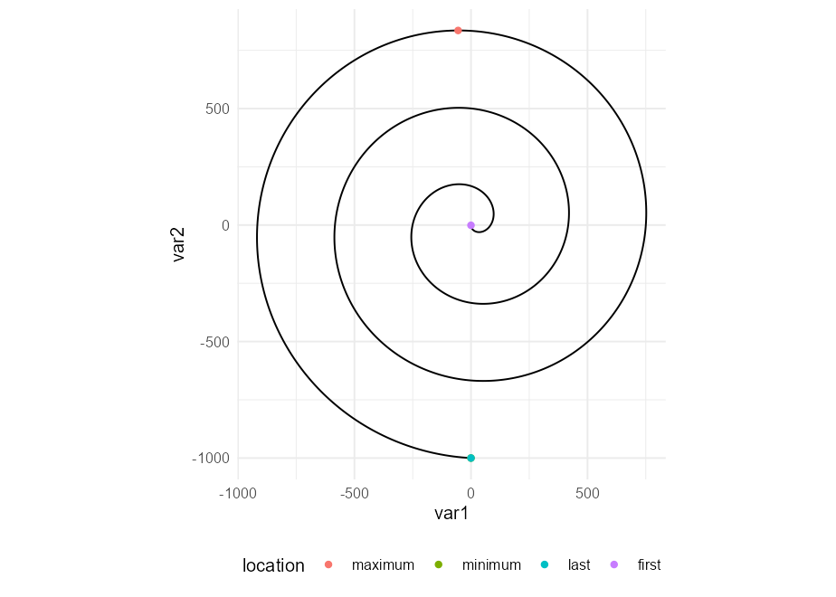
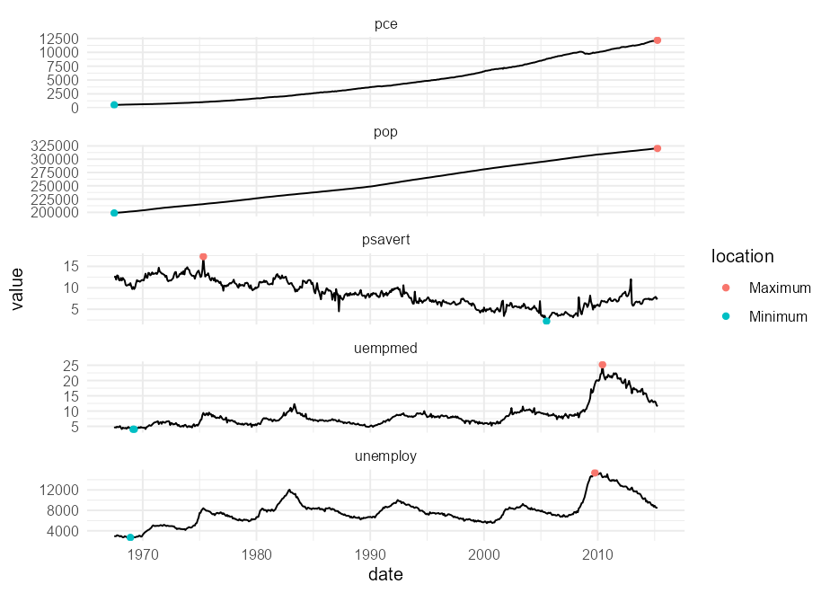

<!-- README.md is generated from README.Rmd. Please edit that file -->

# ggpointless

<!-- badges: start -->

[](https://app.codecov.io/gh/flrd/ggpointless?branch=main)
<!-- badges: end -->

The goal of ggpointless is to add visual sugar to your plots. The
package provides a point layer to highlight some observations such as
the first, last, (global) maxima and minima.

## Installation

You can install the development version of ggpointless from
[GitHub](https://github.com/) with:

``` r
# install.packages("devtools")
devtools::install_github("flrd/ggpointless")
```

## Examples

The one `geom` in this package is `geom_pointless`. It behaves like
`geom_point()` but, by default, `geom_pointless()` adds only a single
point at the last observation.

``` r
library(ggpointless)
# set theme
theme_set(theme_minimal() +
            theme(legend.position = "bottom"))

# dummy data
x <- seq(-2 * pi, 2 * pi, length.out = 500)
y <- sin(1/4 * x) + sin(1/2 * x) + sin(x)
df1 <- data.frame(
  var1 = x,
  var2 = y
)

# ggplot object
p <- ggplot(df1, aes(x = var1, y = var2))
p +
  geom_pointless()
```


You can set the argument `location` to `"first"`, `"last"`, `"minimum"`,
`"maximum"`, and `"all"`, where `"all"` is just shorthand to select
`"first"`, `"last"`, `"minimum"` and `"maximum"`.

``` r
p +
  geom_pointless(location = "all")
```


As you can see, `geom_pointless()` is not terribly useful on its own
(and here I stopped thinking about a better package name) but it is when
it teams up with `geom_line()`, hopefully. `geom_pointless()`
understands the same arguments as `geom_point()` and it computes one
additional variable – `location` – that you can map to an aesthetic,
e.g. `colour`.

``` r
p +
  geom_line() +
  geom_pointless(
    aes(colour = after_stat(location)),
    location = "all",
    size = 3
    )
```


`geom_pointless()` treats the observations in the order in which they
appear in your data (like `geom_path()` does.) Example data taken from
the
[`geomtextpath`](https://github.com/AllanCameron/geomtextpath/#using-geomtextpath)
package:

``` r
x <- seq(5, -1, length.out = 1000) * pi
spiral <- data.frame(var1 = sin(x) * 1:1000, 
                     var2 = cos(x) * 1:1000)

ggplot(spiral, aes(var1, var2)) +
  geom_path() +
  geom_pointless(
    aes(colour = after_stat(location)),
    location = "all") +
  coord_equal()
```



As you see from the last example, `"first"` and `"minimum"` overlap, and
`"first"` wins over `"minimum"`. The order in which points are plotted
(if specified together) from top to bottom is `"first"`, `"last"`,
`"minimum"`, then `"maximum"`.

### Facets

Since we make use the magic of
[`ggplot2`](https://ggplot2.tidyverse.org/), the geom can of course be
used for faceting. The following example is taken from [Stack
Overflow](https://stackoverflow.com/q/29375169/8583393)

``` r
# https://stackoverflow.com/q/29375169/8583393

ggplot(economics_long,
       aes(x = date, y = value)) + 
  geom_line() +
  facet_wrap(~variable, ncol = 1, scales = 'free_y') +
  geom_pointless(
    aes(colour = after_stat(location)),
    location = c("minimum", "maximum")
    )
```



## Why ggpointless?

Fair question.

## Related work

The package [`ggpmisc`](https://exts.ggplot2.tidyverse.org/ggpmisc.html)
provides the stat `stat_peaks`, which calls the `peaks()` function from
the [`splus2r`](https://github.com/spkaluzny/splus2r) package. With
these functions / stats you are able to find and hence highlight *local*
minima and maxima too, besides global extrema.
