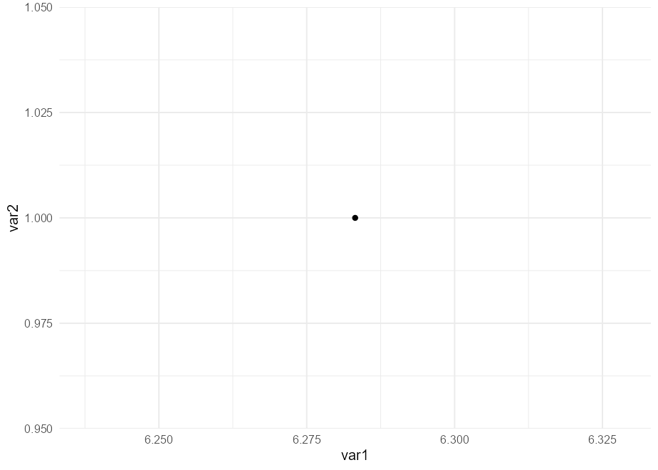
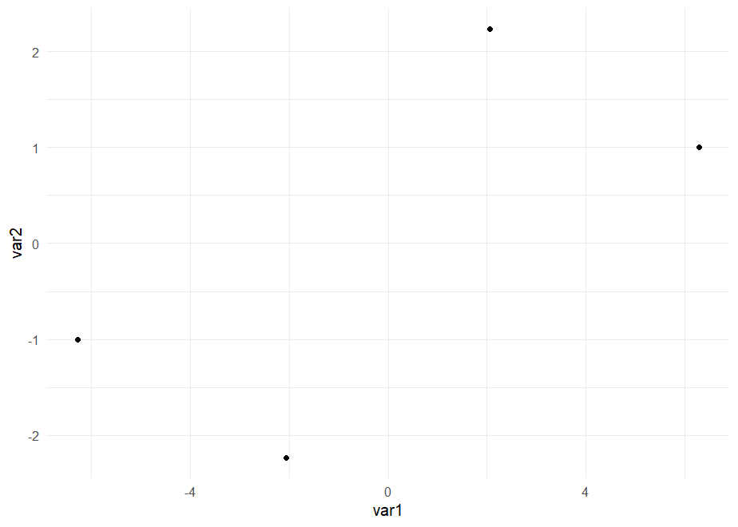
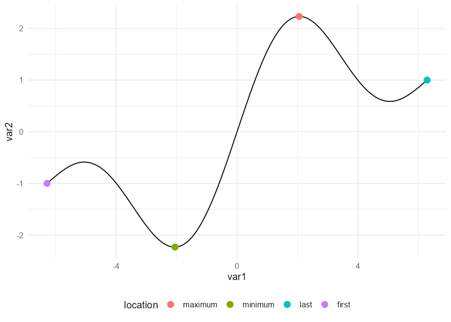

<!-- README.md is generated from README.Rmd. Please edit that file -->

# ggpointless

<!-- badges: start -->

[](https://app.codecov.io/gh/r-lib/usethis?branch=main)
<!-- badges: end -->

The goal of ggpointless is to add visual sugar to your plots. The
package provides a point layer to highlight some observations such as
first, last, (global) maxima and minima.

## Installation

You can install the development version of ggpointless from
[GitHub](https://github.com/) with:

``` r
# install.packages("devtools")
devtools::install_github("flrd/ggpointless")
```

## First examples

The one `geom` in this package is `geom_pointless`. It behaves like
`geom_point()` but, by default, `geom_pointless()` adds only a single
point at the last observation.

``` r
library(ggpointless)
# set theme
theme_set(theme_minimal())

# create dummy data
x <- seq(-2 * pi, 2 * pi, length.out = 500)
y <- sin(1/4 * x) + sin(1/2 * x) + sin(x)

df1 <- data.frame(
  var1 = x,
  var2 = y
)

p <- ggplot(df1, aes(x = var1, y = var2))
p +
  geom_pointless()
```



You can set the argument `location` to `"first"`, `"last"`, `"minimum"`,
`"maximum"`, and `"all"`, where `"all"` is just a shorthand to select
“first”, “last”, “minimum” and “maximum”.

``` r
p +
  geom_pointless(location = "all")
```



As you can see, `geom_pointless()` is not very useful on its own (this
is when I stopped thinking about a better package name) but hopefully it
is when it teams up with `geom_line()`.

`geom_pointless()` creates one additional variable – `location` – that
you can map to an aesthetic, e.g. `colour`.  
It understands the same arguments as `geom_point()`.

``` r
p +
  geom_line() +
  geom_pointless(
    aes(colour = after_stat(location)),
    location = "all",
    size = 3
    )
```



## Why ggpointless?

Fair question.
