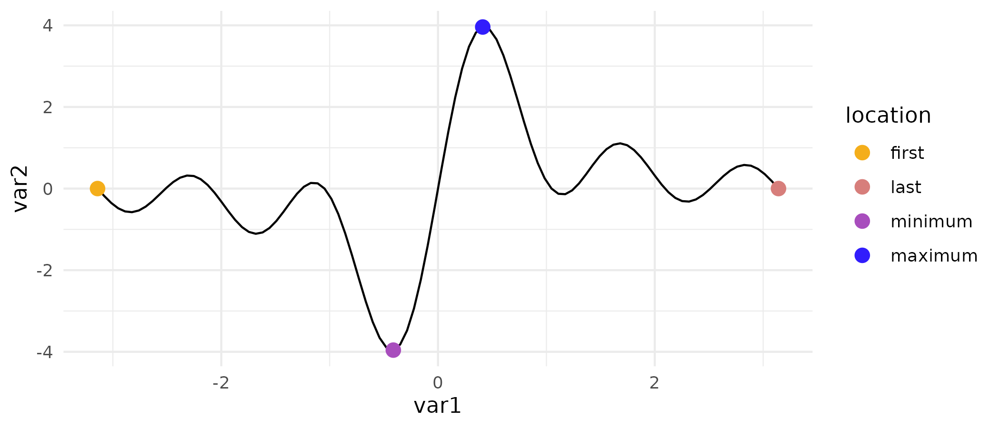
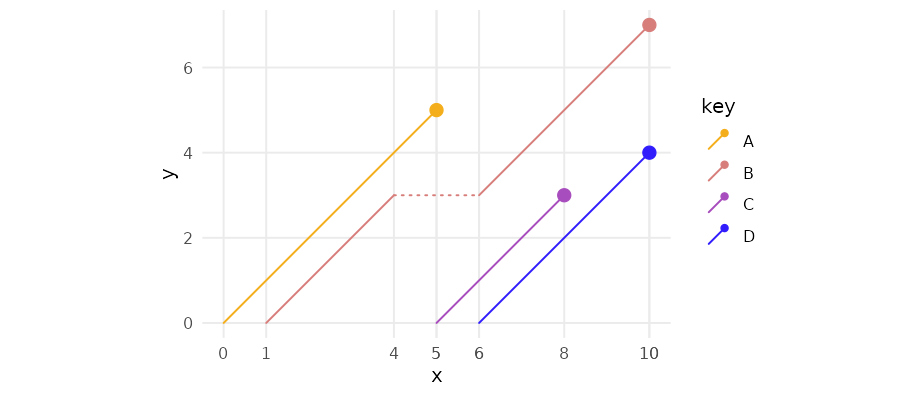

<!-- README.md is generated from README.Rmd. Please edit that file -->

# ggpointless <a href="https://flrd.github.io/ggpointless/"></a>

<!-- badges: start -->

[](https://app.codecov.io/gh/flrd/ggpointless?branch=main)
[](https://github.com/flrd/ggpointless/actions)
[](https://cran.r-project.org/package=ggpointless)
[](http://www.r-pkg.org/pkg/ggpointless)
<!-- badges: end -->

`ggpointless` is an extension of the
[`ggplot2`](https://ggplot2.tidyverse.org/) library providing additional
layers.

The following functions are implemented in this small package:

-   `geom_pointless()` / `stat_pointless()`: functions that are making
    it easy to add minimal emphasis to your plots by means of a point
    layer.

-   `geom_lexis()`: a layer to plot a 45° ‘lifeline’

## Installation

``` r
install.packages("ggpointless")
# Or install the development version
# install.packages("devtools")
devtools::install_github("flrd/ggpointless")
```

## Usage

Using the functions `geom_pointless()`, which is powered by
`stat_pointless()`, you can highlight the first, or last observations,
sample minimum and maximum with the goal to provide some additional
context. Or just some visual sugar. `geom_pointless()` behaves like
`geom_point()` does with the addition of a `location` argument. You can
set it to `"first"`, `"last"` (default), `"minimum"`, `"maximum"`, and
`"all"`, where `"all"` is just shorthand to select `"first"`, `"last"`,
`"minimum"` and `"maximum"`.

``` r
cols <- c('#f4ae1b', '#d77e7b', '#a84dbd', '#311dfc')
x <- seq(-pi, pi, length.out = 500)
y <- outer(x, 1:5, function(x, y) sin(x*y))

df1 <- data.frame(
  var1 = x,
  var2 = rowSums(y)
)

ggplot(df1, aes(x = var1, y = var2)) +
  geom_line() +
  geom_pointless(aes(color = after_stat(location)),
                 location = "all",
                 size = 3) +
  scale_color_manual(values = cols) +
  theme_minimal()
```



`geom_lexis()` is a combination of a segment and a point layer. Given a
start and an end, this functions draws a 45° line.

``` r
df2 <- data.frame(
  key = c("A", "B", "B", "C", "D"),
  start = c(0, 1, 6, 5, 6),
  end = c(5, 4, 9, 9, NA)
)

ggplot(df2, aes(x = start, xend = end, color = key)) +
  geom_lexis(aes(linetype = after_scale(type)), point.size = 3) +
  scale_x_continuous(breaks = unique(c(df2$start, df2$end))) +
  scale_color_manual(values = cols) +
  coord_equal() +
  theme_minimal() +
  theme(panel.grid.minor = element_blank())
#> Missing 'xend' values set to 9
```



See the `vignette("ggpointless")` for more details.

## Data

The `ggpointless` package contains two data sets:

1.  `co2_ml` : [CO<sub>2</sub> records taken at Mauna Loa,
    Hawaii](https://gml.noaa.gov/ccgg/trends/data.html)
2.  `covid_vac` : [COVID-19 Cases and Deaths by Vaccination
    Status](https://covid.cdc.gov/covid-data-tracker/#rates-by-vaccine-status)

See the `vignette("examples")` for possible use cases.

## Code of Conduct

Please note that this project is released with a [Contributor Code of
Conduct](https://github.com/flrd/ggpointless/blob/master/conduct.md). By
participating in this project you agree to abide by its terms.
