<!-- README.md is generated from README.Rmd. Please edit that file -->

# ggpointless 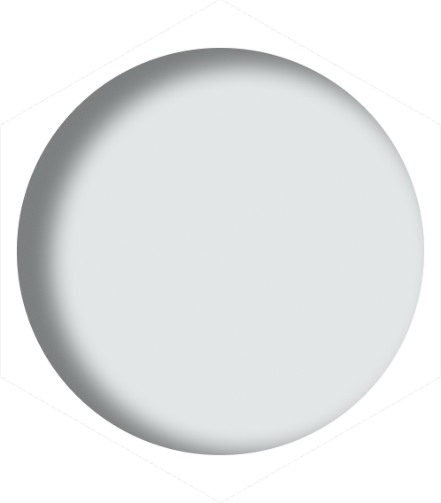

<!-- badges: start -->

[](https://cran.r-project.org/package=ggpointless)
[](https://github.com/flrd/ggpointless/actions/workflows/R-CMD-check.yaml)

[](https://app.codecov.io/gh/flrd/ggpointless)
<!-- badges: end -->

`ggpointless` is an extension of the
[`ggplot2`](https://ggplot2.tidyverse.org/) package providing additional
layers. These layers group into two categories:

Data transformations — geoms that fit or transform data:

- `geom_arch()` & `stat_arch()` – draws a catenary arch
- `geom_catenary()` & `stat_catenary()` – draws a catenary curve
- `geom_chaikin()` & `stat_chaikin()` – smooths paths using Chaikin’s
  corner cutting algorithm
- `geom_fourier()` & `stat_fourier()` – fits a Fourier series to `x`/`y`
  observations
- `geom_gridline()` – gridlines as a layer (drawn above other geoms)
- `geom_lexis()` & `stat_lexis()` – draws a Lexis diagram
- `geom_pointless()` & `stat_pointless()` – emphasises selected
  observations with points

Visual effects — purely aesthetic layers that change how data looks
without transforming it. The following layers are mostly drop-in
replacements for their `ggplot2` counterparts. They add visual flair
like alpha gradients but no statistical transformation:

- `geom_abline_fade()` / `geom_hline_fade()` / `geom_vline_fade()`
- `geom_area_fade()`
- `geom_col_fade()` / `geom_bar_fade()`
- `geom_density_fade()`
- `geom_freqpoly_fade()`
- `geom_histogram_fade()`
- `geom_path_fade()` / `geom_line_fade()` / `geom_step_fade()`
- `geom_point_glow()`
- `geom_rect_fade()`
- `geom_ridgeline_fade()` / `geom_ridgeline_density_fade()` /
  `geom_ridgeline_freqpoly_fade()` / `geom_ridgeline_histogram_fade()`
- `geom_segment_fade()` / `geom_curve_fade()`
- `geom_unit_bar()` / `geom_unit_col()` – isotype / unit bar charts
- `geom_unit_histogram()` – isotype / unit histogram

See the [Examples
article](https://flrd.github.io/ggpointless/articles/ggpointless.html)
for more examples.

## Installation

`ggpointless` requires **R** ≥ 4.2 and `ggplot2` ≥ 4.0.0. You can
install it from CRAN with:

``` r
install.packages("ggpointless")
```

## Usage

The chunk below sets a colour palette so the README plots share a
consistent look. It’s not required; only the look of your plots will
differ.

``` r
library(ggplot2)
library(ggpointless)

# Brand palette -- kept in sync with the vignette
cols <- c("#311dfc", "#a84dbd", "#d77e7b", "#f4ae1b")
theme_set(
  theme_minimal() +
    theme(
      legend.position           = "bottom",
      geom                      = element_geom(fill = cols[1]),
      palette.fill.discrete     = cols,
      palette.colour.discrete   = cols,
      palette.fill.continuous   = cols,
      palette.colour.continuous = cols
    )
)
```

## Statistical transformations

### Catenary curves and arches

``` r
set.seed(5)
df_catenary <- data.frame(x = 1:4, y = sample(4))
ggplot(df_catenary, aes(x, y)) +
  geom_catenary() +
  geom_point(size = 3)
```


``` r
ggplot(df_catenary, aes(x, y)) +
  geom_catenary(
    sag = c(2, .5, NA),
    chain_length = c(NA, 4, 6)) +
  geom_point(size = 3)
#> Both `sag` and `chain_length` supplied for 1 segment; using `sag`.
#> This message is displayed once every 8 hours.
```

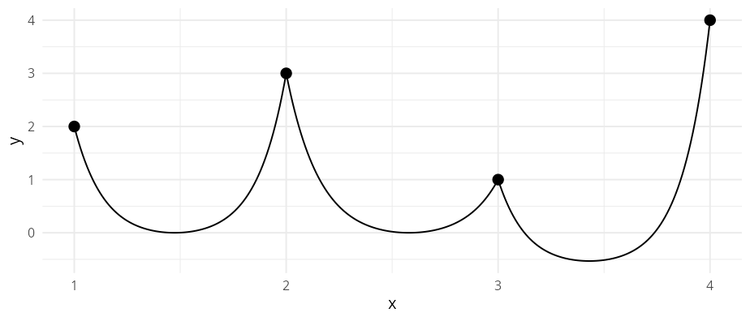

``` r
ggplot(df_catenary, aes(x, y)) +
  geom_arch(
    arch_height = c(1.5, NA, 0.5),
    arch_length = c(NA, 6, NA)
    ) +
  geom_point(size = 3)
```

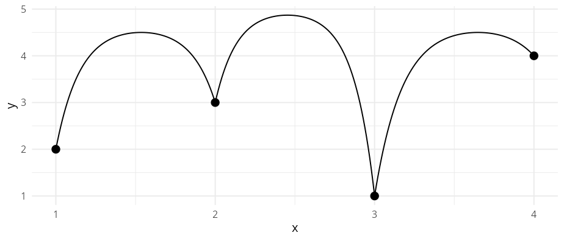

### Chaikin’s corner cutting algorithm

``` r
lst <- list(
  data = list(
    whale = data.frame(x = c(.5, 4, 4, 3.5, 2), y = c(.5, 1, 1.5, .5, 3)),
    closed_square = data.frame(x = c(0, 0, 1, 1), y = c(2, 3, 3, 2)),
    open_triangle = data.frame(x = c(3, 3, 5), y = c(2, 3, 3)),
    closed_triangle = data.frame(x = c(3.5, 5, 5), y = c(0, 0, 1.5))
  ),
  color = cols,
  mode = c("closed", "closed", "open", "closed")
)

ggplot(mapping = aes(x, y)) +
  lapply(lst$data, \(i) {
    geom_polygon(data = i, fill = NA, linetype = "12", color = "#333333")
  }) +
  Map(f = \(data, color, mode) {
    geom_chaikin(data = data, color = color, mode = mode)
  }, data = lst$data, color = lst$color, mode = lst$mode) +
  geom_point(data = data.frame(x = 1.5, y = 1.5)) +
  coord_equal()
```


### Discrete Fourier transform

``` r
x_d <- seq(0, 4 * pi, length.out = 15)
df_d <- data.frame(
  x = x_d,
  y = sin(x_d) + x_d * 0.4 + rnorm(15, sd = 0.2)
)

p <- ggplot(df_d, aes(x, y)) +
  geom_point(alpha = 0.35)
p + geom_fourier()
```

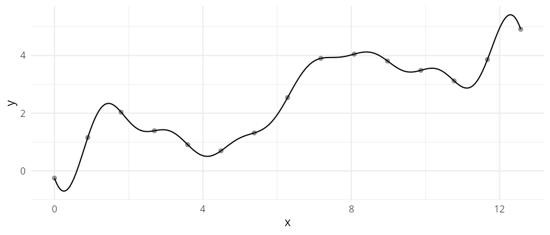

``` r
p +
  geom_fourier(
    aes(colour = "detrend = NULL"),
    n_harmonics = 3
  ) +
  geom_fourier(
    aes(colour = "detrend = \"lm\""),
    n_harmonics = 3,
    detrend = "lm"
  )
```

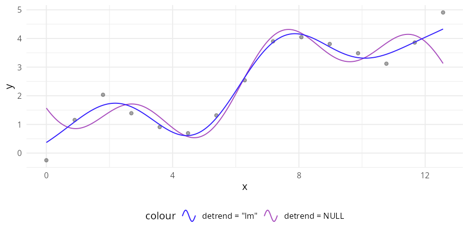

### Draw (grid)lines above bars and other geoms

``` r
ggplot(mpg, aes(class)) +
  geom_bar() +
  geom_gridline()
```

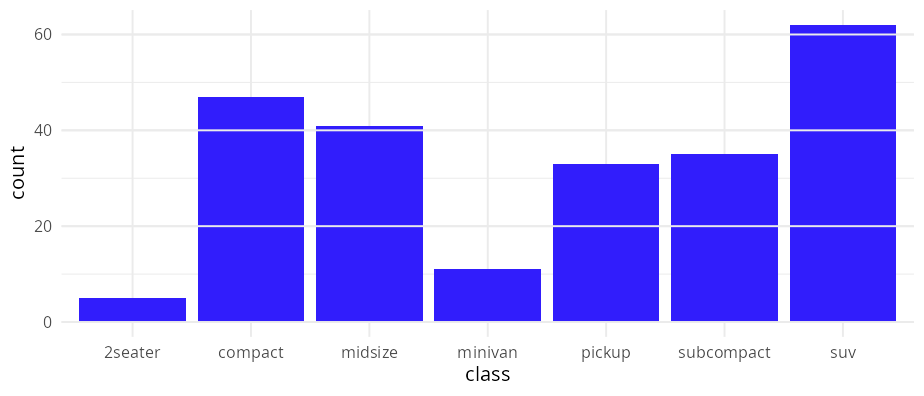

``` r
p <- ggplot(mpg, aes(y = class)) +
  geom_bar() +
  geom_gridline(grids = "x")

# geom_gridline inherits its line properties from theme
p + theme(panel.grid = element_line(colour = "white"))
```

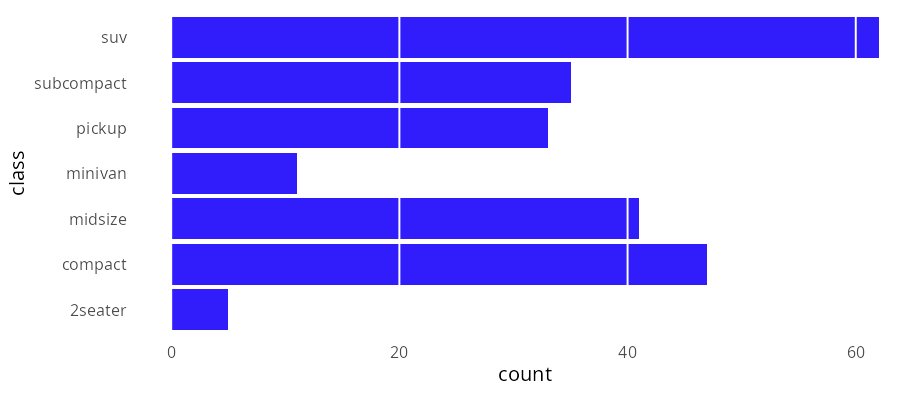

``` r
# The x/y positions are deducted from the scale(s)
p + scale_x_sqrt()
```

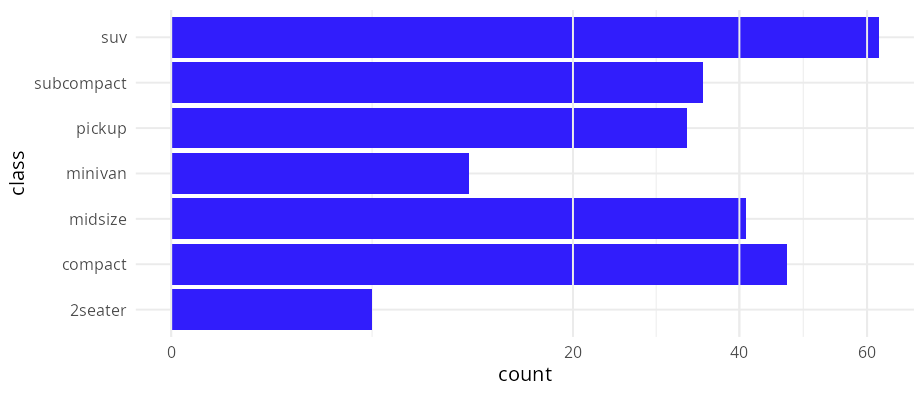

``` r
# You can overwrite these properties of course
p + 
  geom_gridline(grids = "x", colour = cols[4], linewidth = 1.5) +
  scale_x_sqrt(breaks = c(10, 20, 30, 40, 50))
```

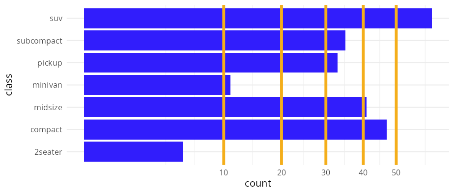

### Lexis diagrams

``` r
df_lexis <- data.frame(
  key = c("A", "B", "B", "C", "D"),
  x = c(0, 1, 6, 5, 6),
  xend = c(5, 4, 10, 8, 10)
)

ggplot(df_lexis, aes(x = x, xend = xend, color = key)) +
  geom_lexis(aes(linetype = after_stat(type)), size = 2) +
  coord_equal() +
  scale_x_continuous(breaks = c(df_lexis$x, df_lexis$xend)) +
  scale_linetype_identity() +
  theme(panel.grid.minor = element_blank())
```

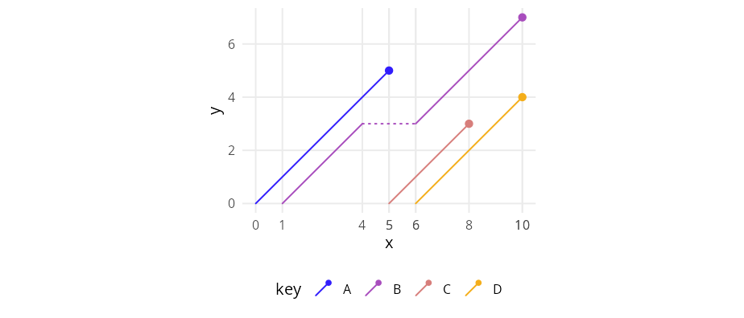

### Emphasise some observations

``` r
sunspot_df <- data.frame(
  year = time(datasets::sunspot.year),
  sunspots = unclass(datasets::sunspot.year)
)
ggplot(tail(sunspot_df, 12), aes(year, sunspots)) + 
  geom_step(colour = cols[4]) +
  geom_pointless(location = c("first", "last"), size = 3, colour = cols[4])
```

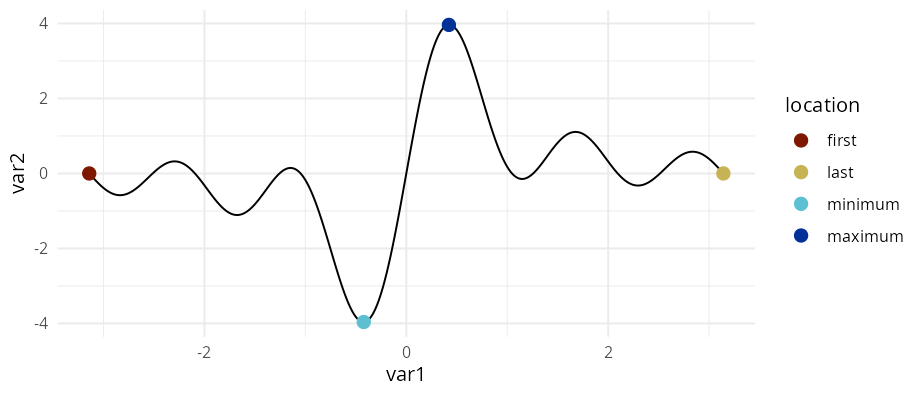

## Visual effects

### Fading area, density, and ridgeline charts

``` r
set.seed(42)
df_fade <- data.frame(
  x = seq_len(60),
  y = cumsum(rnorm(60, sd = 0.35))
)

p <- ggplot(df_fade, aes(x, y))
p + geom_area_fade()
```

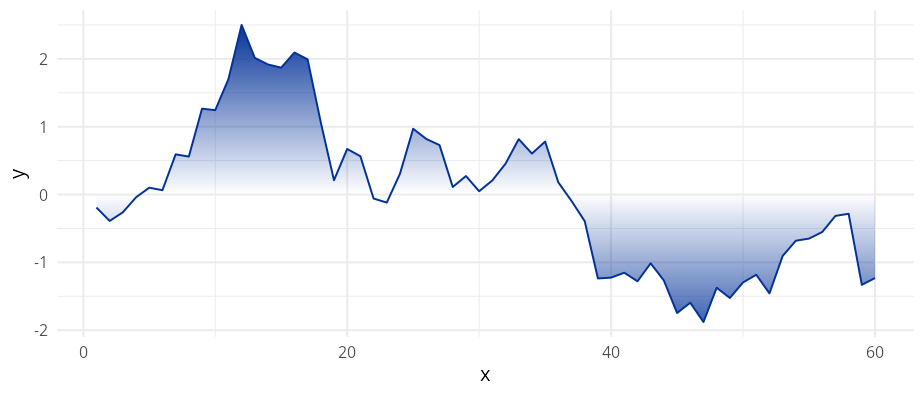

``` r
ggplot(iris, aes(Sepal.Length)) +
  geom_freqpoly_fade(alpha = 0, alpha_fade_to = 1)
#> `stat_bin()` using `bins = 30`. Pick better value `binwidth`.
```

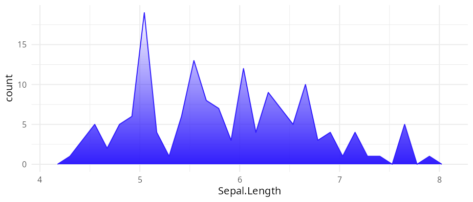

``` r
dmn <- list(
  month.abb,
  time(datasets::nottem) |> floor() |> unique()
)
df_nottem <- datasets::nottem |> 
  matrix(data = _, 12, dimnames = dmn) |> 
  as.data.frame() |> 
  stack() |> 
  cbind(month = factor(month.abb, levels = month.abb))

p <- ggplot(df_nottem, aes(x = values, group = month, fill = after_stat(x))) +
  labs(
    x = NULL,
    y = NULL,
    caption = "Average air temperatures at Nottingham Castle in degrees Fahrenheit (1920–1939)"
  ) +
  guides(fill = "none") +
  scale_x_continuous(expand = 0)

p + geom_density_fade(
  outline.type = "none"
  )
```

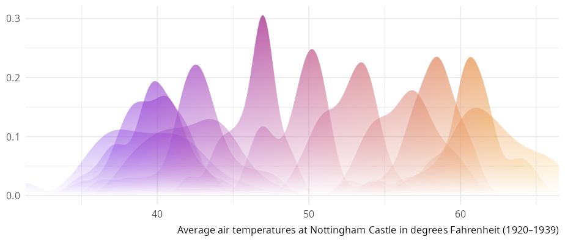

``` r
p <- p + aes(y = month)
p + geom_ridgeline_density_fade(
  alpha_scope = "global",
  outline.type = "none"
  )
#> ℹ Using auto-computed `scale = 6.5`.
#> • Pass an explicit `scale` to override.
```

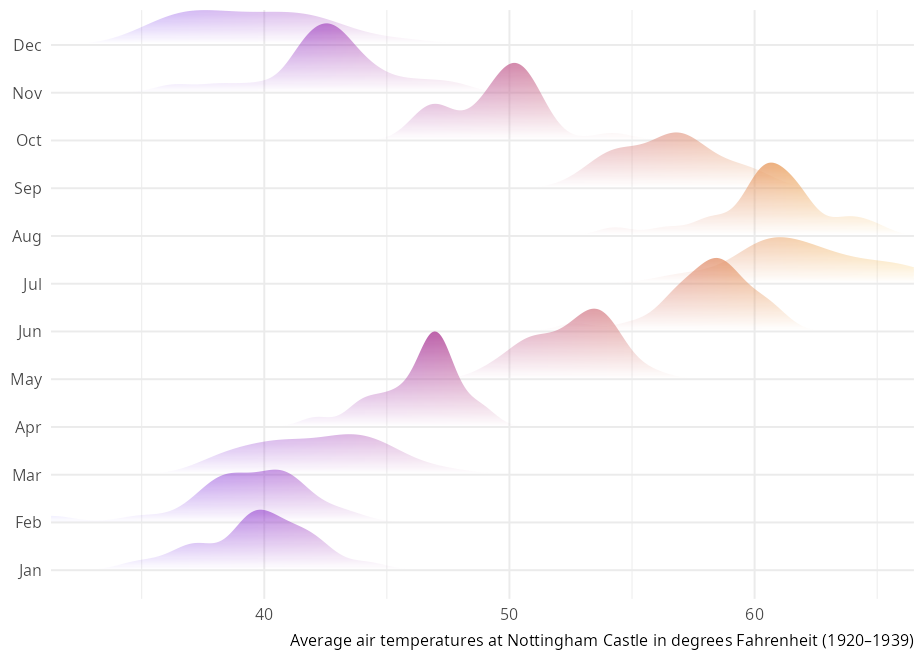

``` r
p + geom_ridgeline_freqpoly_fade(
  alpha_scope = "global",
  linewidth = 0.25
  )
#> ℹ Using auto-computed `scale = 0.2`.
#> • Pass an explicit `scale` to override.
```

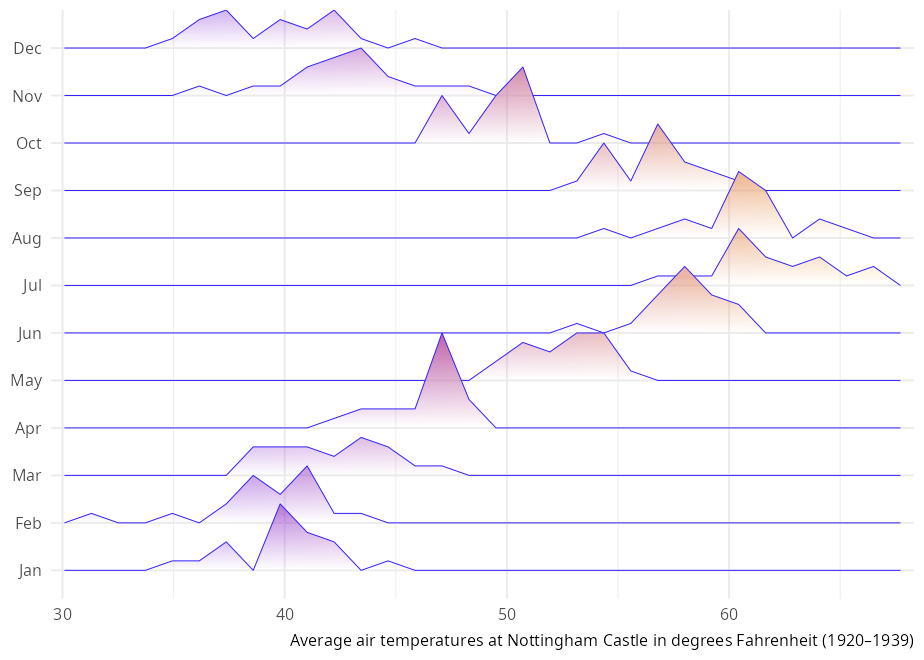

``` r
p + geom_ridgeline_histogram_fade(
  alpha_scope = "group",
  bins = 40,
  linewidth = 0.25
  )
#> ℹ Using auto-computed `scale = 0.29`.
#> • Pass an explicit `scale` to override.
```

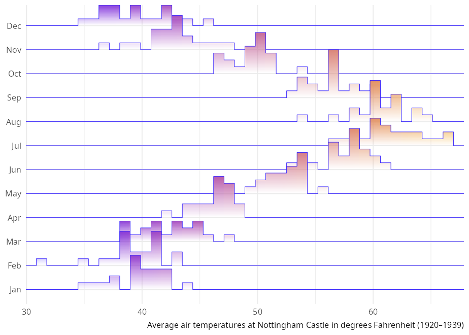

### Points that glow

``` r
anscombe_long <- reshape(anscombe, varying = TRUE, sep = "", direction = "long", timevar = "tv")
ggplot(anscombe_long, aes(x, y)) +
  geom_point_glow(colour = cols[1]) +
  facet_wrap(~tv) +
  coord_equal(clip = "off") 
```

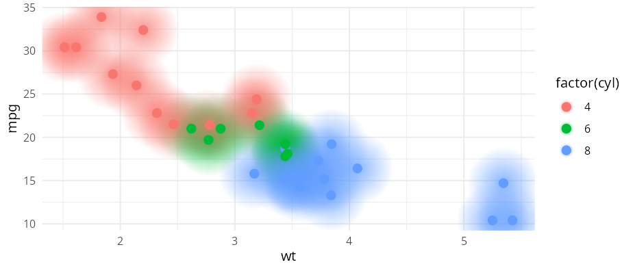

### Fading curves, lines, and paths

``` r
b <- ggplot(mtcars, aes(wt, mpg)) +
  geom_point()

df <- data.frame(x1 = 2.62, x2 = 3.57, y1 = 21.0, y2 = 15.0)
b +
  geom_curve_fade(
    aes(x = x1, y = y1, xend = x2, yend = y2, colour = "curve"),
    arrow = arrow(),
    data = df
  ) +
  geom_segment_fade(
    aes(x = x1, y = y1, xend = x2, yend = y2, colour = "segment"),
    data = df
  )
```

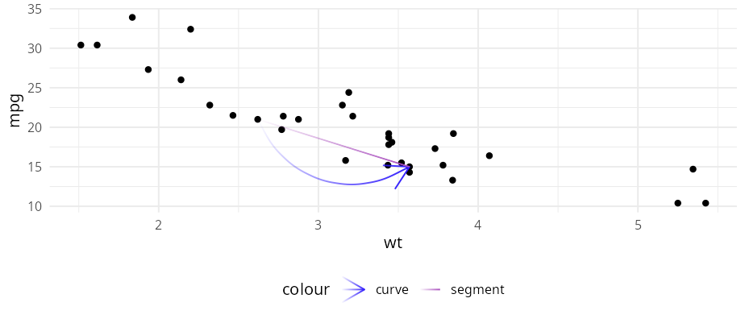

``` r
theta <- seq(1.3, -1.3, length.out = 101)
ichthys <- data.frame(
  x = theta^2,
  y = 0.5 * theta * (theta^2 - 1)
)

ggplot(ichthys, aes(x, y)) + 
  geom_path_fade(
    linewidth = 1.5,
    fade_direction = c("start", "end"),
    alpha_mode = "gradient"
  ) +
  coord_fixed()
```

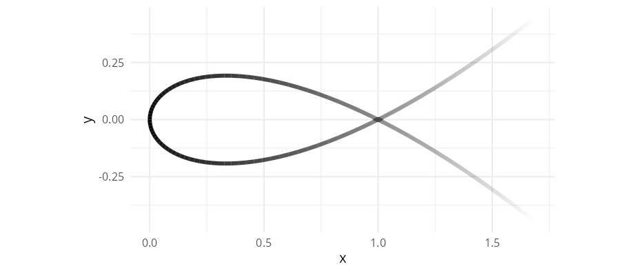

``` r
p <- ggplot() +
  geom_abline_fade(intercept = 0, colour = "#a84dbd", linewidth = 1) +
  geom_hline_fade(yintercept = 1, colour = "#d77e7b", linewidth = 1) +
  geom_vline_fade(xintercept = 1, colour = "#f4ae1b", linewidth = 1) +
  xlim(0, 2) +
  ylim(0, 2)
  
p
```

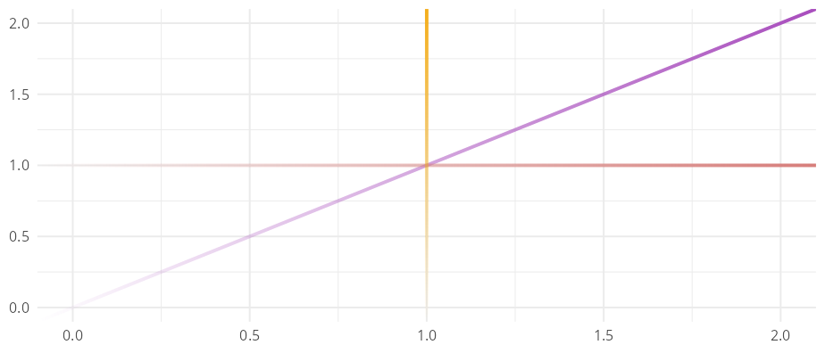

``` r
p + coord_polar()
```

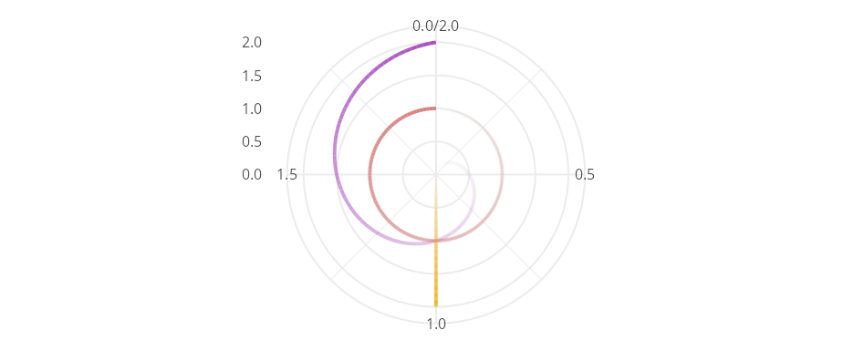

``` r
ggplot() +
  stat_function(
    alpha = 0.5,
    fun = dnorm,
    n = 100,
    xlim = c(-4, 4),
    geom = "area_fade",
    outline.type = "none" # remove solid outline
  ) +
  # Add fading outline instead
  stat_function(
    fun = dnorm, n = 100,
    xlim = c(-4, 4),
    geom = "line_fade",
    colour = cols[1],
    linewidth = 1,
    fade_direction = c("start", "end")
  )
```

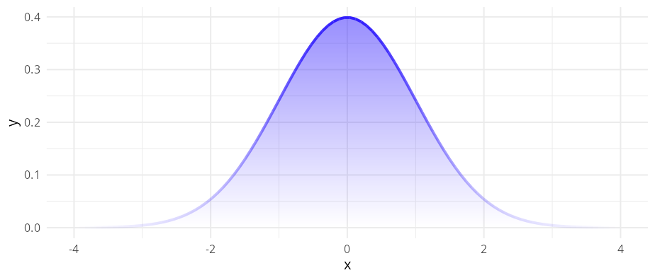

``` r
ggplot(head(economics, 25), aes(date, unemploy)) +
  geom_step_fade(alpha_fade_to = 0.1)
```

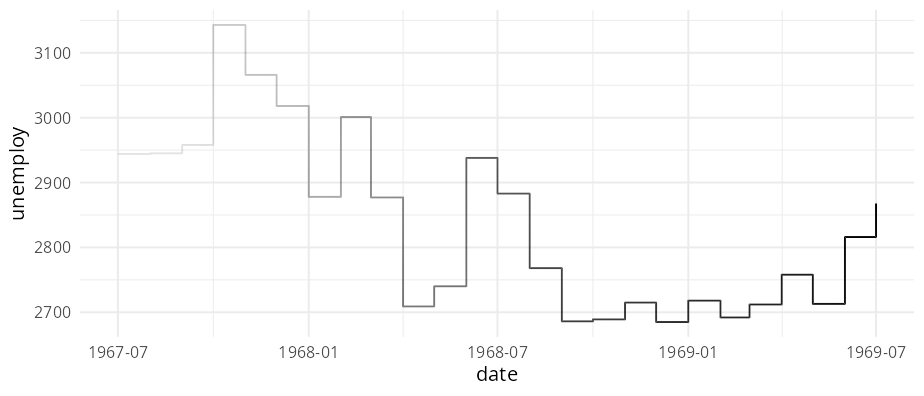

### Fading rectangles and bar charts with rounded corners

``` r
ggplot(head(economics, 25), aes(date, unemploy)) +
  geom_rect_fade(
    data = data.frame(
      xmin = as.Date("1968-07-01"),
      xmax = as.Date("1969-07-01"),
      ymin = -Inf, ymax = 2800
    ),
    inherit.aes = FALSE,
    alpha = 0,
    alpha_fade_to = 0.3,
    aes(xmin = xmin, xmax = xmax, ymin = ymin, ymax = ymax)
  ) +
  geom_step_fade(alpha_fade_to = 0.1)
```

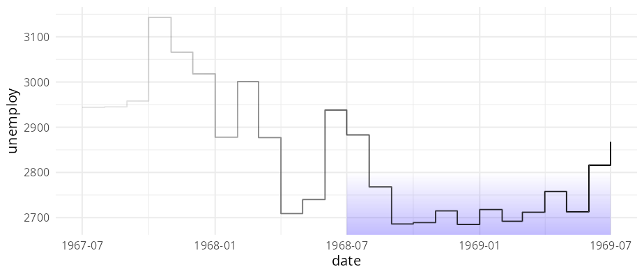

``` r
ggplot(mpg, aes(y = class)) +
  geom_bar_fade()
```

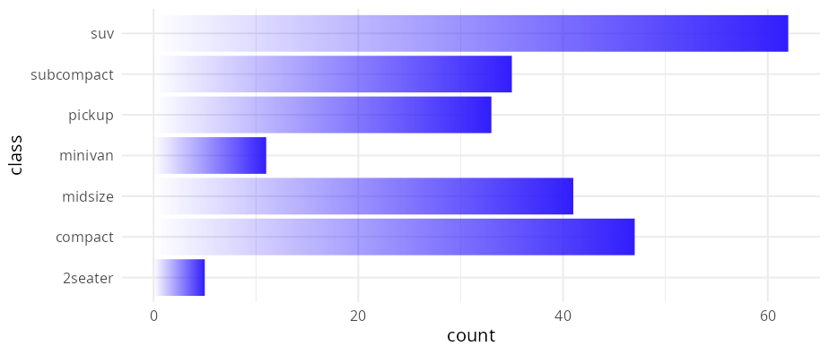

``` r
ggplot(datasets::BOD, aes(Time, demand)) +
  geom_col_fade(
    radius = unit(10, "pt"),
    alpha = 0.75,
    alpha_fade_to = 0.25,
    alpha_scope = "global"
    )
```

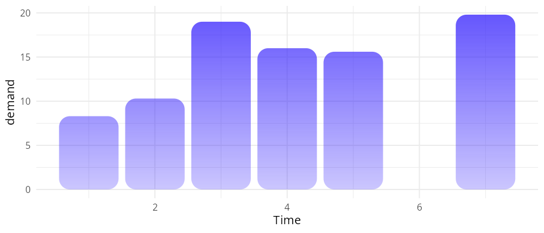

``` r
ggplot(faithful, aes(eruptions)) +
  geom_histogram_fade(
    alpha = 0.8,
    alpha_fade_to = 0.1,
    alpha_scope = "global"
    ) +
  geom_step(
    stat = "bin",
    direction = "mid",
    colour = cols[1]
    )
#> `stat_bin()` using `bins = 30`. Pick better value `binwidth`.
#> `stat_bin()` using `bins = 30`. Pick better value `binwidth`.
```

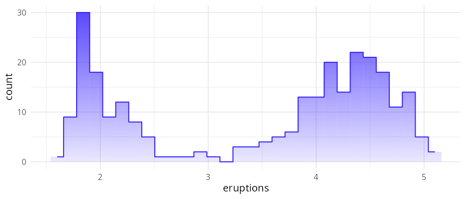
\### Unit bar charts and histograms

``` r
bins <- 30
bw <- diff(range(faithful$eruptions)) / bins

ggplot(faithful, aes(eruptions)) +
  geom_unit_histogram(
    aes(fill = after_stat(x)),
    radius = unit(1, "pt"),
    bins = bins
  ) +
  labs(
    y = NULL
  ) +
  guides(fill = "none") +
  scale_x_continuous(
    breaks = 2:5,
    labels = paste(2:5, "min")
  ) +
  coord_equal(ratio = 1/3 * bw, clip = "off") +
  theme(
    panel.grid.minor = element_blank(),
    panel.grid.major.x = element_blank(),
    axis.ticks    = element_blank()
  )
```

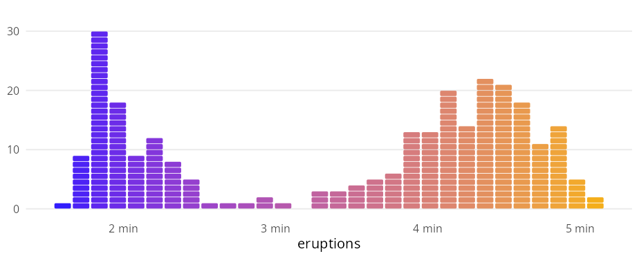

``` r
cs <- 100
ggplot(diamonds, aes(y = cut, fill = color)) +
  geom_unit_bar(
    cell_size = cs,
    radius = unit(1, "pt"),
    position = "dodge"
    ) +
  labs(
    x = NULL,
    y = NULL,
    caption = sprintf("One cell equals %d observations.", cs)) +
  coord_equal(ratio = 7 * cs) +
  theme_minimal()
#> ! `radius` of 1 pt exceeds the largest displayable corner radius for the
#>   rendered shape.
#> ℹ Maximum displayable radius is 0.52 pt; falling back to that.
```

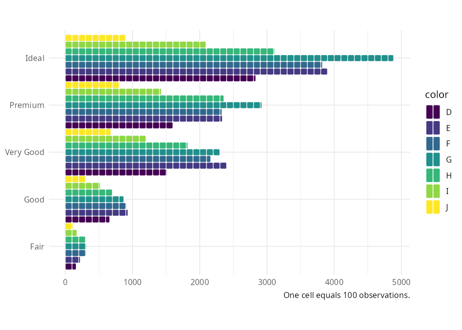

The `geom_unit_*` family was inspired by the work of
[pudding.cool](https://pudding.cool/2017/09/this-american-life/).

## Accessibility

Visual effects can quietly exclude readers. The faded end of any
gradient geom drops below
[WCAG](https://en.wikipedia.org/wiki/Web_Content_Accessibility_Guidelines)
contrast thresholds for low-vision readers. Pair colour with `linetype`,
`shape`, or labels for categorical encodings; prefer
colour-vision-deficiency-safe (CVD-safe) palettes like
`scale_colour_viridis_d()` or Okabe–Ito; and raise `alpha_fade_to` when
the faded region carries data your readers need to find.

The 4-stop palette `cols` used in this README and the Examples article
is monotonic in luminance, so it survives greyscale conversion and the
stop ordering is preserved under CVD. The middle hues collapse under
deuteranopia, however, so for cases where hue identity carries
information rather than ordering, prefer `scale_fill_viridis_c()` /
`scale_colour_viridis_c()`.

## Device compatibility

The 2D gradients used by `geom_area_fade()` and friends depend on
**Porter-Duff compositing**[^1], a feature of R’s graphics engine added
in R 4.2. When the active device does not support compositing
(e.g. `grDevices::pdf()`), the fade family falls back to a single-colour
vertical fade — the horizontal colour gradient is lost, only the
vertical alpha fade survives, and a one-time message is emitted:

> ! `geom_area_fade()`: the graphics device does not support gradient
> fills. The `fill` colour gradient is replaced by a single colour.
> Switch to a device that supports gradients (e.g. `ragg::agg_png()`,
> `svg()`, `cairo_pdf()`) for the full effect. This message is displayed
> once per session.

Most modern raster devices — including `ragg::agg_png()` and the
Cairo-backed `png()` shipped on Linux and macOS — *do* support
compositing, so the 2D gradient works out of the box. In RStudio, go to
*Tools \> Global Options \> Graphics \> Backend* and select *AGG* to
ensure full support.

## Code of Conduct

Please note that this project is released with a [Contributor Code of
Conduct](https://github.com/flrd/ggpointless/blob/main/CODE_OF_CONDUCT.md).
By participating in this project you agree to abide by its terms.

[^1]: <https://www.stat.auckland.ac.nz/~paul/Reports/GraphicsEngine/compositing/compositing.html>
