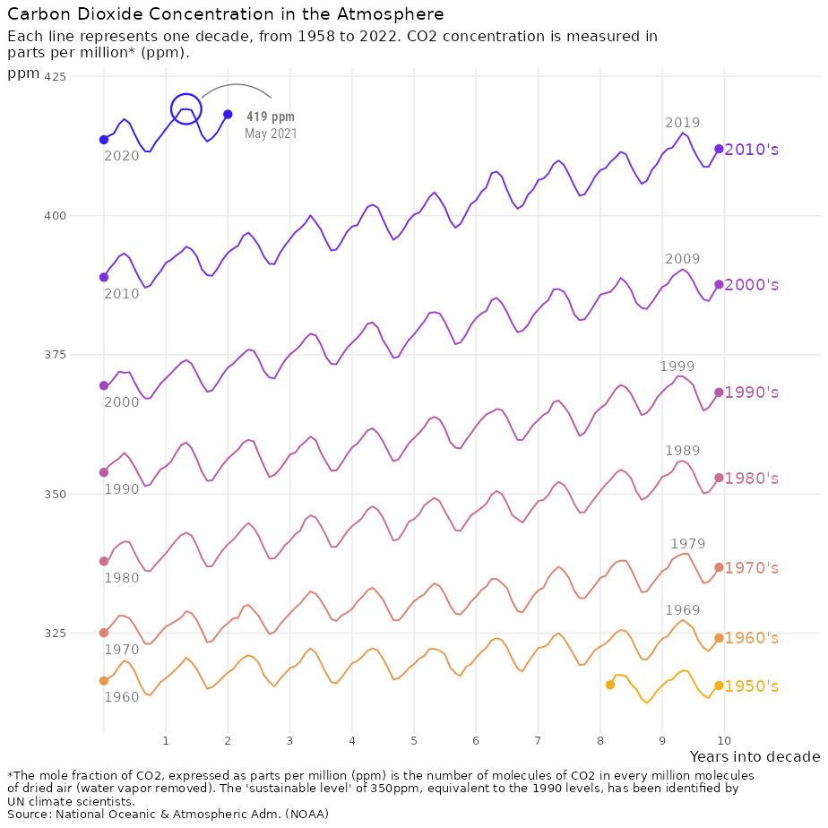

<!-- README.md is generated from README.Rmd. Please edit that file -->

# ggpointless

<!-- badges: start -->

[](https://app.codecov.io/gh/flrd/ggpointless?branch=main)
[](https://github.com/flrd/ggpointless/actions)
<!-- badges: end -->

The package provides a simple point layer to emphazise some observations
in your data.

## Installation

You can install the development version of `ggpointless` from
[GitHub](https://github.com/) with:

``` r
# install.packages("devtools")
devtools::install_github("flrd/ggpointless")
```

## Usage

There are two functions in the `ggpointless` package:
`geom_pointless()`, which is powered by `stat_pointless()`. Both
functions add a point layer to a `ggplot` object by default. In addition
to `geom_point()` the function have an additional `location` argument.
You can set it to `"first"`, `"last"` (default), `"minimum"`,
`"maximum"`, and `"all"`, where `"all"` is just shorthand to select
`"first"`, `"last"`, `"minimum"` and `"maximum"`.

See the `vignette("ggpointless")` for more details.

``` r
x <- seq(-pi, pi, length.out = 100)
y <- outer(x, 1:5, function(x, y) sin(x*y)) |> rowSums()

df1 <- data.frame(
  var1 = x,
  var2 = y
)

theme_set(theme_minimal())

ggplot(df1, aes(x = var1, y = var2)) +
  geom_line() +
  geom_pointless(aes(colour = after_stat(location)),
                 location = "all",
                 size = 3) +
  scale_color_manual(values = c('#f4ae1b', '#d77e7b', '#a84dbd', '#311dfc'))
```


## Motivation

The motivation behind this layer is to create a visual effect. Take this
recreation of a plot from [Gregor Aisch](https://driven-by-data.net/)
about [Carbon dioxide concentration over
time](https://blog.datawrapper.de/weekly-chart-carbon-dioxide/).



## Data

The `ggpointless` package contains two dataset:

1.  `co2_ml` : [CO<sub>2</sub> records taken at Mauna
    Loa](https://gml.noaa.gov/ccgg/trends/data.html)
2.  `covid_vac` : [COVID-19 Cases and Deaths by Vaccination
    Status](https://covid.cdc.gov/covid-data-tracker/#rates-by-vaccine-status)
