# Introduction to ggpointless

`ggpointless` is a small extension of the
[`ggplot2`](https://ggplot2.tidyverse.org/) package that provides
additional layers:

1.  [`geom_area_fade()`](https://flrd.github.io/ggpointless/dev/reference/geom_area_fade.md)
2.  [`geom_arch()`](https://flrd.github.io/ggpointless/dev/reference/geom_catenary.md)
    &
    [`stat_arch()`](https://flrd.github.io/ggpointless/dev/reference/geom_catenary.md)
3.  [`geom_catenary()`](https://flrd.github.io/ggpointless/dev/reference/geom_catenary.md)
    &
    [`stat_catenary()`](https://flrd.github.io/ggpointless/dev/reference/geom_catenary.md)
4.  [`geom_chaikin()`](https://flrd.github.io/ggpointless/dev/reference/geom_chaikin.md)
    &
    [`stat_chaikin()`](https://flrd.github.io/ggpointless/dev/reference/geom_chaikin.md)
5.  [`geom_fourier()`](https://flrd.github.io/ggpointless/dev/reference/geom_fourier.md)
    &
    [`stat_fourier()`](https://flrd.github.io/ggpointless/dev/reference/geom_fourier.md)
6.  [`geom_lexis()`](https://flrd.github.io/ggpointless/dev/reference/geom_lexis.md)
    &
    [`stat_lexis()`](https://flrd.github.io/ggpointless/dev/reference/geom_lexis.md)
7.  [`geom_point_glow()`](https://flrd.github.io/ggpointless/dev/reference/geom_point_glow.md)
8.  [`geom_pointless()`](https://flrd.github.io/ggpointless/dev/reference/geom_pointless.md)
    &
    [`stat_pointless()`](https://flrd.github.io/ggpointless/dev/reference/geom_pointless.md)

## geom_area_fade

[`geom_area_fade()`](https://flrd.github.io/ggpointless/dev/reference/geom_area_fade.md)
behaves like
[`geom_area()`](https://ggplot2.tidyverse.org/reference/geom_ribbon.html)
but fills each group with a linear gradient that fades from the fill
colour to transparent at the baseline, drawing the eye to the signal
rather than the area underneath.

``` r
ggplot(economics, aes(date, unemploy)) +
  geom_area_fade()
```

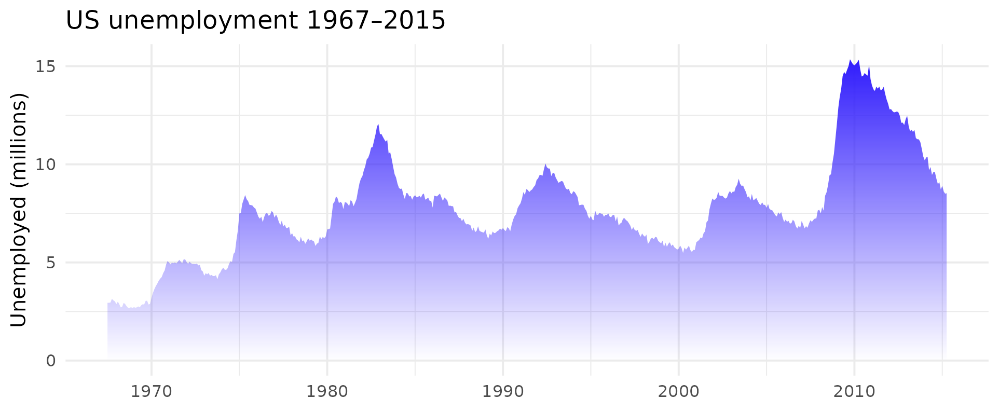

Use `alpha` to set the starting opacity and `alpha_fade_to` to control
where the gradient ends. The direction can be reversed — transparent at
the top, opaque at the baseline — by swapping their values.

``` r
ggplot(economics, aes(date, unemploy)) +
  geom_area_fade(alpha = 0.5, alpha_fade_to = 0.05)
```

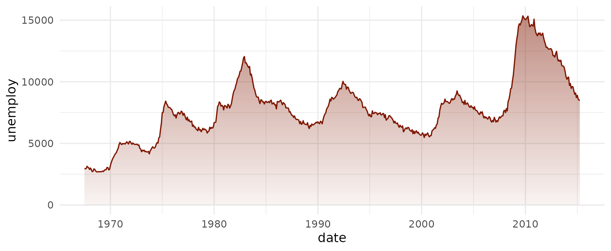

Multiple groups each get their own gradient:

``` r
df <- data.frame(
  g = c("a", "a", "a", "b", "b", "b"),
  x = c(1, 3, 5, 2, 4, 6),
  y = c(2, 5, 1, 3, 6, 7)
)
ggplot(df, aes(x, y, fill = g)) +
  geom_area_fade(alpha = 0.5)
```

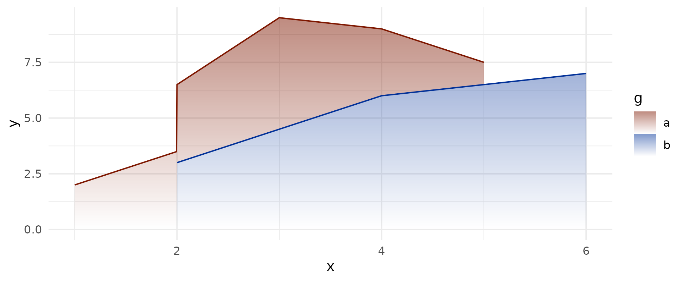

### 2D gradient

When `fill` is mapped to a variable inside
[`aes()`](https://ggplot2.tidyverse.org/reference/aes.html), ggplot2
builds a **horizontal** colour gradient across each group.
[`geom_area_fade()`](https://flrd.github.io/ggpointless/dev/reference/geom_area_fade.md)
overlays its vertical alpha schedule on top, giving a true
two-dimensional gradient: colour varies left-to-right while opacity
fades from the data line down to the baseline.

``` r
set.seed(42)
df_fade <- data.frame(
  x = seq_len(60),
  y = cumsum(rnorm(60, sd = 0.35))
)
df_fade$y <- df_fade$y - mean(df_fade$y)

ggplot(df_fade, aes(x, y, fill = y)) +
  geom_area_fade(colour = "#333333")
```

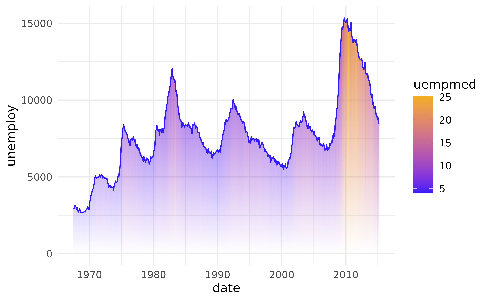

### Device compatibility and the fallback

The 2D gradient depends on **Porter-Duff compositing**, a feature of R’s
graphics engine added in R 4.2. When the active graphics device does not
support compositing
(e.g. [`grDevices::pdf()`](https://rdrr.io/r/grDevices/pdf.html)),
[`geom_area_fade()`](https://flrd.github.io/ggpointless/dev/reference/geom_area_fade.md)
falls back to a single-colour vertical fade: the horizontal colour
gradient is lost, only the vertical alpha fade survives, and a one-time
message is emitted.

Most modern raster devices — including
[`ragg::agg_png()`](https://ragg.r-lib.org/reference/agg_png.html) and
the Cairo-backed [`png()`](https://rdrr.io/r/grDevices/png.html) shipped
on Linux and macOS — **do** support compositing, so the 2D gradient
works out of the box. In RStudio, go to *Tools \> Global Options \>
Graphics \> Backend* and select *AGG* to ensure full support.

## geom_arch & stat_arch

### Catenary curves and arches

A **catenary** is the curve formed by a flexible chain or cable hanging
freely between two fixed supports. It follows this equation:

$$y = a\cosh\!\left( \frac{x}{a} \right)$$

[`geom_arch()`](https://flrd.github.io/ggpointless/dev/reference/geom_catenary.md)
draws these inverted catenary curves between successive points. The
shape is controlled by `arch_length` or `arch_height` (vertical rise
above the highest endpoint of each segment). By default the arc length
is twice the Euclidean distance.

``` r
ggplot(data.frame(x = 1:2, y = c(0, 0)), aes(x, y)) +
  geom_arch(arch_height = 0.6)
```

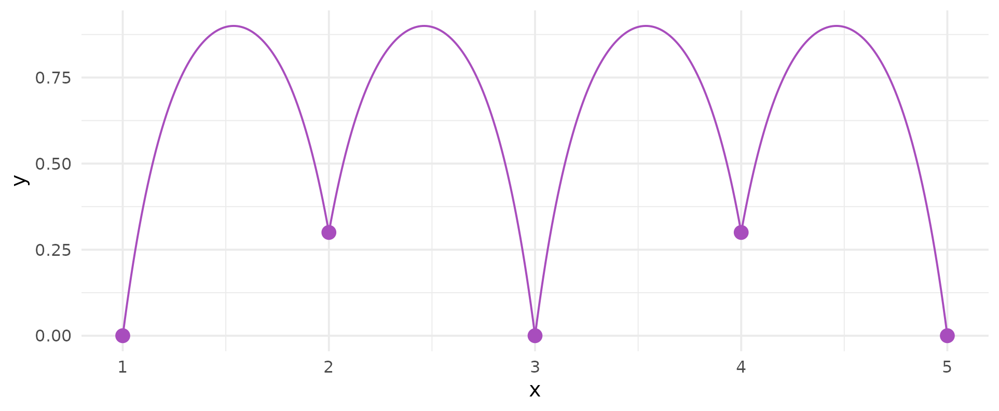

### The Rice House

A real-world application is the **[Rice
House](https://en.wikipedia.org/wiki/Rice_House,_Eltham)** in Eltham,
whose distinctive roofline consists of shallow catenary arched spans
rising above vertical columns. The sketch below reconstructs its
simplified cross-section:

``` r
rice_house <- data.frame(
  x = c(0, 1.5, 2.5, 3.5, 5),
  y = c(0, 1, 1, 1, 0)
)

ggplot(rice_house, aes(x, y)) +
  geom_arch(arch_height = 0.15, linewidth = 2, colour = "#333333") +
  geom_segment(aes(xend = x, yend = 0), colour = "#333333") +
  geom_hline(yintercept = 0, colour = "#4a7c59", linewidth = 3) +
  coord_equal() +
  theme_void() +
  labs(caption = "Rice House, Eltham (simplified catenary cross-section)")
```

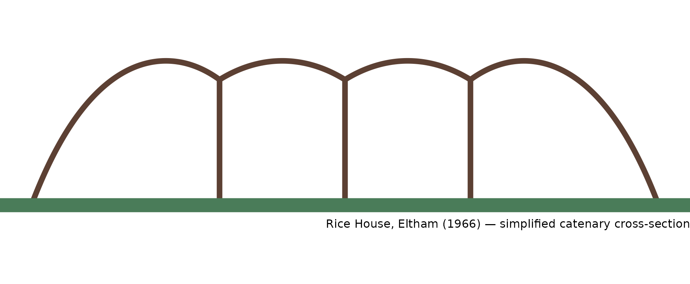

### Controlling arch height with stat_arch

[`stat_arch()`](https://flrd.github.io/ggpointless/dev/reference/geom_catenary.md)
exposes the underlying computation. Here it shows the effect of
different `arch_height` values between the same two endpoints:

``` r
ggplot(data.frame(x = c(0, 2), y = c(0, 0)), aes(x, y)) +
  stat_arch(arch_height = 0.5, colour = roma[1]) +
  stat_arch(arch_height = 1.5, colour = roma[2]) +
  stat_arch(arch_height = 3.0, colour = roma[3]) +
  labs(title = "arch_height = 0.5, 1.5, 3.0")
```

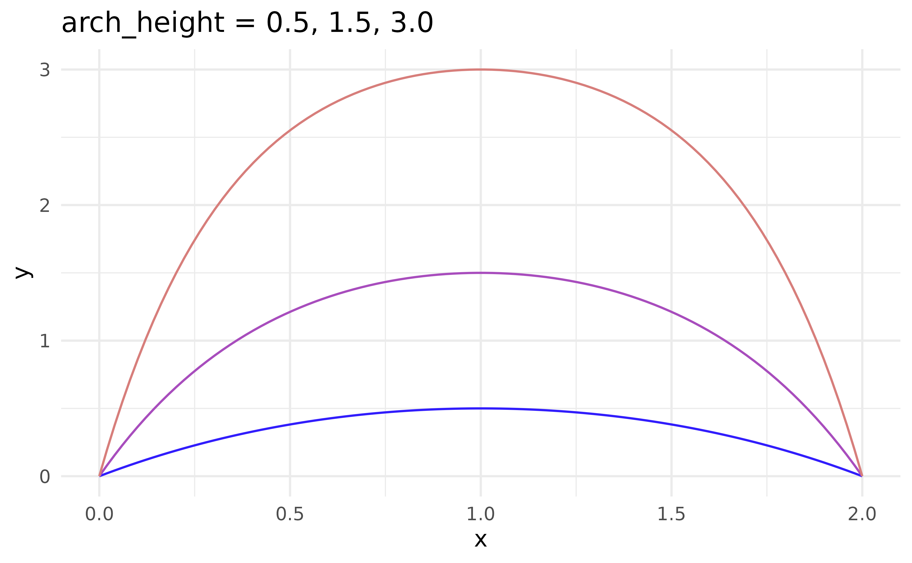

## geom_catenary & stat_catenary

[`geom_catenary()`](https://flrd.github.io/ggpointless/dev/reference/geom_catenary.md)
draws the *non*-inverted, hanging-chain form between successive points.

``` r
set.seed(1)
ggplot(data.frame(x = 1:6, y = sample(6)), aes(x, y)) +
  geom_catenary() +
  geom_point(size = 3, colour = "#333333")
```

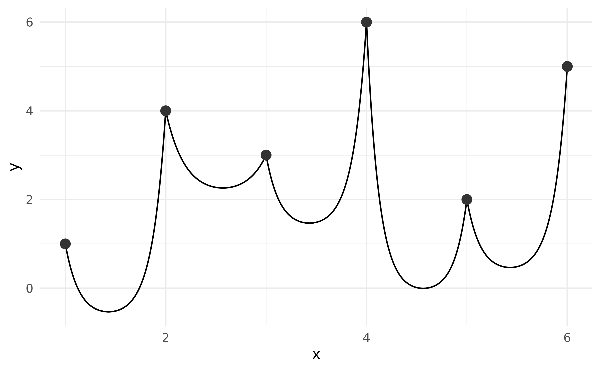

### chain_length

By default the chain length is twice the Euclidean distance per segment.
Pass `chain_length` to set an explicit arc length — longer values make
the chain sag more. If the value is shorter than the straight-line
distance a warning is issued and a straight line is drawn instead.

``` r
ggplot(data.frame(x = c(0, 2), y = c(1, 1)), aes(x, y)) +
  lapply(seq(1.1, 2.5, by = 0.3), \(cl) {
    geom_catenary(chain_length = cl)
  }) +
  ylim(NA, 1.05) +
  labs(title = "Increasing chain_length adds more sag")
#> Warning: The `chain_length` (1.1) is shorter than the distance (2) between (0, 1) and
#> (2, 1). Drawing a straight line.
#> Warning: The `chain_length` (1.4) is shorter than the distance (2) between (0, 1) and
#> (2, 1). Drawing a straight line.
#> Warning: The `chain_length` (1.7) is shorter than the distance (2) between (0, 1) and
#> (2, 1). Drawing a straight line.
```

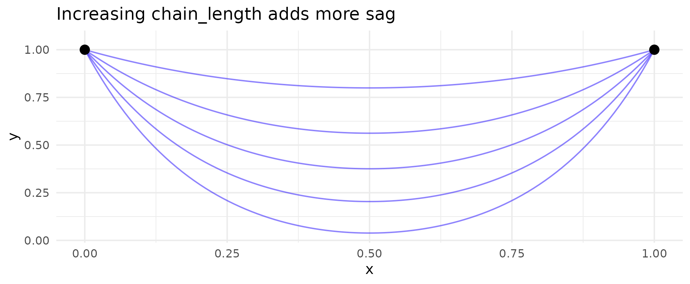

### sag

`sag` sets the vertical drop below the lowest endpoint of each segment,
giving you direct control over how much the chain droops:

``` r
df_sag <- data.frame(x = c(0, 2, 4, 6), y = c(1, 1, 1, 1))

ggplot(df_sag, aes(x, y)) +
  geom_catenary(sag = c(0.1, 0.5, 1.2)) +
  geom_point(size = 3, colour = "#333333") +
  labs(title = "sag = 0.1, 0.5, 1.2 (left to right)") +
  ylim(c(-.25, 1))
```

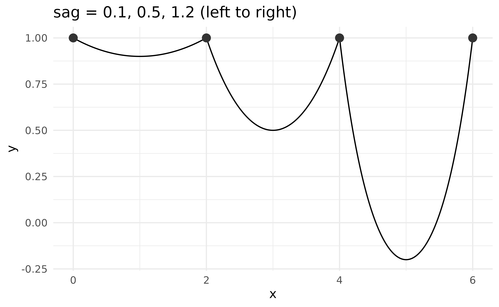

### combine chain_length and sag

`sag` sets the vertical drop below the lowest endpoint of each segment,
giving you direct control over how much the chain droops:

``` r
df_sag <- data.frame(x = c(0, 2, 4, 6), y = c(1, 1, 1, 1))

ggplot(df_sag, aes(x, y)) +
  geom_catenary(
    chain_length = c(2, NA, 3),
    sag = c(0.1, 0.5, NA)
  ) +
  geom_point(size = 3, colour = "#333333") +
  labs(title = "sag wins over chain_length") +
  ylim(c(-.25, 1))
#> Both `sag` and `chain_length` supplied for 1 segment; using `sag`.
#> This message is displayed once every 8 hours.
```

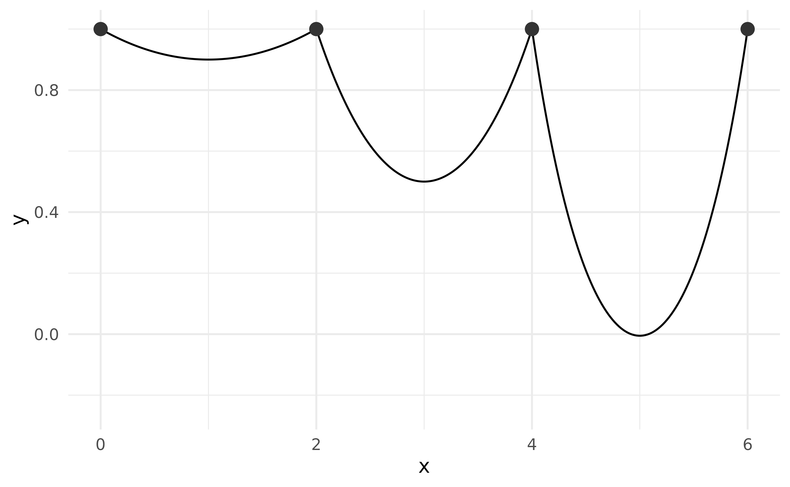

## geom_chaikin & stat_chaikin

Chaikin’s corner-cutting algorithm smooths a polygonal path by
iteratively replacing each corner with two new points placed at a given
ratio along the adjacent edges. With `ratio = 0.25` (the default) and
`iterations = 5` the path converges to a smooth B-spline approximation.

``` r
set.seed(42)
dat <- data.frame(x = seq.int(10), y = sample(15:30, 10))

ggplot(dat, aes(x, y)) +
  geom_line(linetype = "dashed", colour = "#333333") +
  geom_chaikin(colour = roma[2])
```

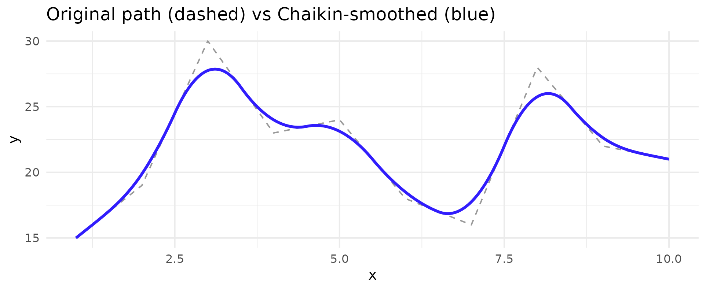

### Effect of ratio

`ratio` controls how aggressively corners are cut. At `ratio = 0.5` the
new points coincide with the edge midpoints, producing the maximum
rounding possible in a single pass.

``` r
triangle <- data.frame(x = c(0, 0.5, 1), y = c(0, 1, 0))

ggplot(triangle, aes(x, y)) +
  geom_polygon(fill = NA, colour = "grey70", linetype = "dashed") +
  geom_chaikin(ratio = 0.10, mode = "closed", colour = roma[1]) +
  geom_chaikin(ratio = 0.25, mode = "closed", colour = roma[2]) +
  geom_chaikin(ratio = 0.50, mode = "closed", colour = roma[3]) +
  coord_equal() +
  labs(subtitle = "ratio = 0.10, 0.25, 0.50")
```

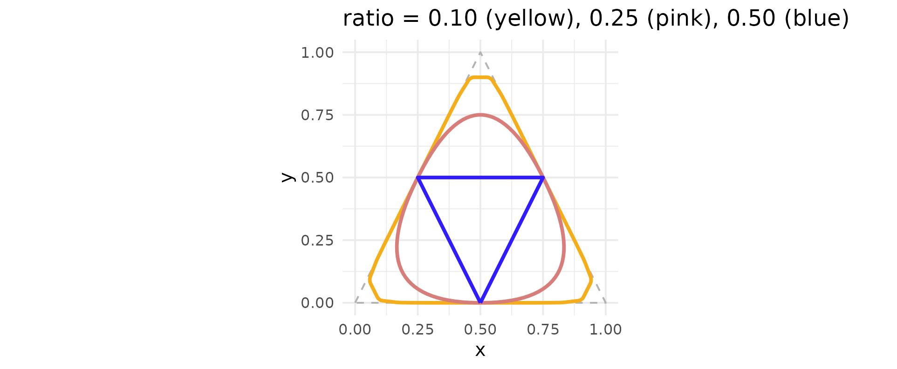

### Smoothing a closed polygon with stat_chaikin

[`stat_chaikin()`](https://flrd.github.io/ggpointless/dev/reference/geom_chaikin.md)
can be combined with any geom. Pass `geom = "polygon"` to smooth the
boundary of a filled shape:

``` r
# An irregular hexagon
hex <- data.frame(
  x = c(0.0, 0.4, 1.0, 1.2, 0.9, 0.1),
  y = c(0.2, 1.0, 0.9, 0.3, -0.2, 0.0)
)

ggplot(hex, aes(x, y)) +
  geom_polygon(fill = "grey85", colour = "#333333", linetype = "dashed") +
  stat_chaikin(geom = "polygon", mode = "closed", alpha = 0.45, colour = NA) +
  coord_equal() +
  labs(title = "Original polygon (dashed) with smoothed fill (purple)")
```

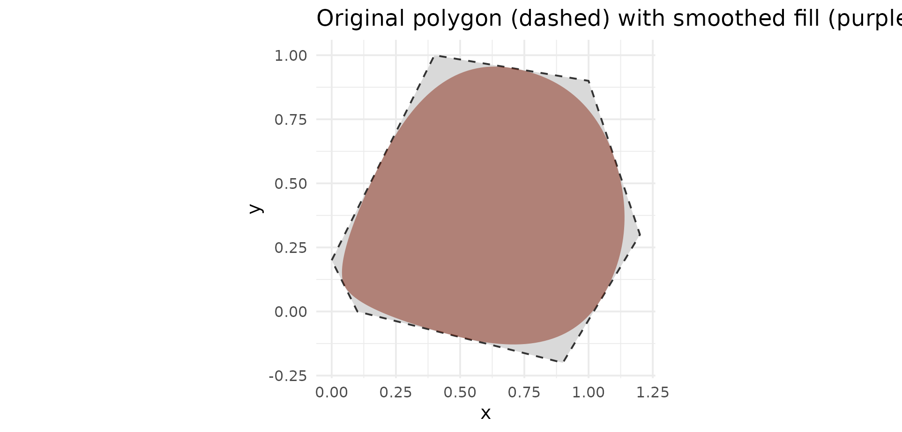

## geom_fourier & stat_fourier

[`geom_fourier()`](https://flrd.github.io/ggpointless/dev/reference/geom_fourier.md)
fits a truncated **discrete Fourier transform** to the supplied x/y data
and renders the reconstructed curve. Fewer harmonics produce a smoother,
low-frequency summary; retaining all harmonics reproduces the original
signal exactly (up to interpolation artefacts).

``` r
set.seed(42)
n <- 150
df_f <- data.frame(
  x = seq(0, 2 * pi, length.out = n),
  y = sin(seq(0, 2 * pi, length.out = n)) +
    0.4 * sin(3 * seq(0, 2 * pi, length.out = n)) +
    rnorm(n, sd = 0.25)
)

ggplot(df_f, aes(x, y)) +
  geom_point(alpha = 0.25, size = 0.8, colour = "#333333") +
  geom_fourier(n_harmonics = 1, colour = roma[1]) +
  geom_fourier(n_harmonics = 3, colour = roma[2]) +
  geom_fourier(n_harmonics = 10, colour = roma[3]) +
  labs(
    title = "1 harmonic, 3, 10 (light to dark)",
    x = NULL, y = NULL
  )
```

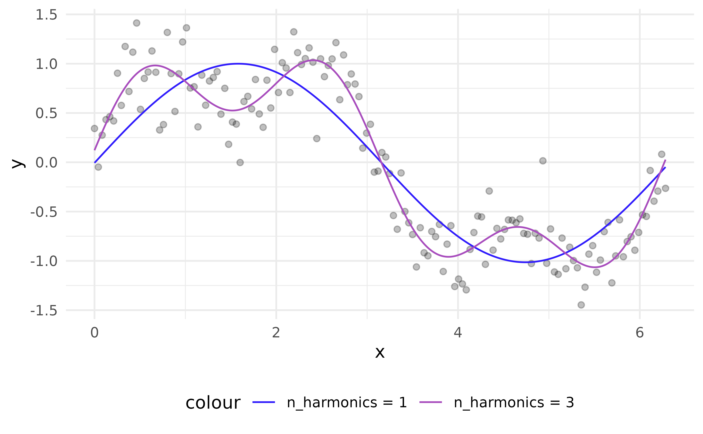

### Detrending

A linear drift in the data will dominate the low-frequency coefficients,
preventing the Fourier series from capturing the periodic structure. Set
`detrend = "lm"` (or `"loess"`) to subtract the trend before the
transform; it is added back afterwards so the output remains on the
original scale.

``` r
set.seed(3)
x_d <- seq(0, 4 * pi, length.out = 100)
df_d <- data.frame(
  x = x_d,
  y = sin(x_d) + x_d * 0.4 + rnorm(100, sd = 0.2)
)

ggplot(df_d, aes(x, y)) +
  geom_point(alpha = 0.35, size = 0.8, colour = "#333333") +
  geom_fourier(aes(colour = "as is"),
    n_harmonics = 3,
    linetype = "dashed"
  ) +
  geom_fourier(aes(colour = "detrend = 'lm'"), n_harmonics = 3, detrend = "lm") +
  labs(
    title = "geom_fourier() w/wo detrending",
    x = NULL, y = NULL
  )
```

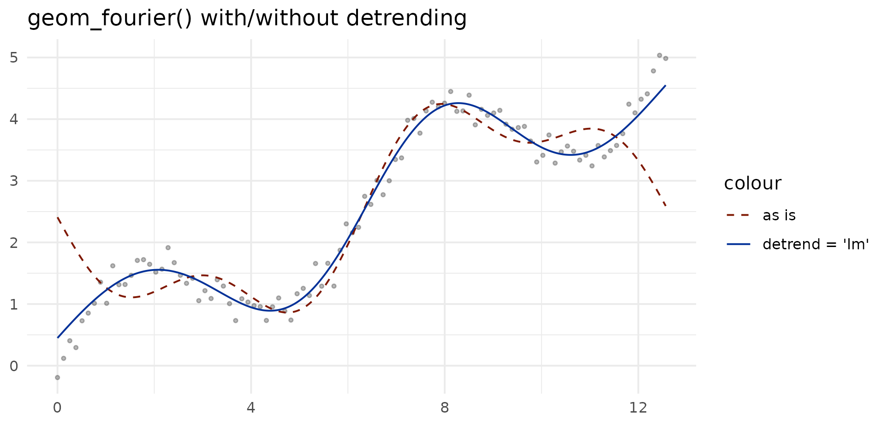

### Pitfall: irregular spacing with calendar dates

The Fourier transform (via
[`stats::fft()`](https://rdrr.io/r/stats/fft.html)) assumes that
observations are **evenly spaced** in time. When you hand it calendar
dates directly, this assumption is silently violated: months have 28–31
days, so consecutive observations are not the same distance apart.

The example below maps `date` — a `Date` vector — to the x aesthetic and
asks
[`geom_fourier()`](https://flrd.github.io/ggpointless/dev/reference/geom_fourier.md)
to reconstruct the signal with all harmonics (`n_harmonics = NULL`). You
might expect the Fourier curve to pass through every data point, but it
does not:

``` r
ggplot(head(economics, 12 * 6), aes(date, psavert)) +
  geom_line(linetype = "dotted") +
  geom_point(size = 1) +
  geom_fourier(n_harmonics = NULL) +
  labs(
    title = "geom_fourier() with Date x-axis — curve misses observations",
    x = NULL
  )
```

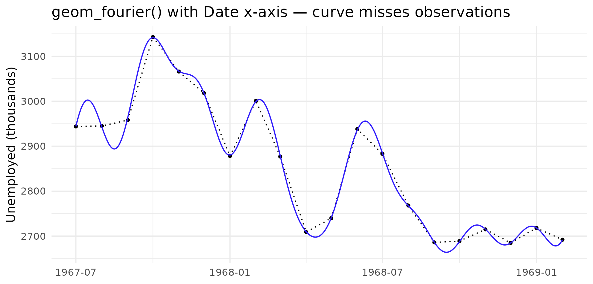

The Fourier layer converts dates to their underlying integer
representation (days since 1970-01-01), constructs a **uniform** grid of
that many integer steps, computes the inverse FFT on that grid, and
draws a line through those interpolated points. Because the grid points
fall between observation dates, the curve misses the actual data points
even when every harmonic is included.

To fix this you can replace the date x-axis with a plain integer index
so that spacing is guaranteed to be uniform. You can restore
human-readable year labels with
[`scale_x_continuous()`](https://ggplot2.tidyverse.org/reference/scale_continuous.html):

``` r
eco <- head(economics, 12 * 6)
eco$tmp <- seq_len(nrow(eco))

# integer positions for year-start labels
yr_breaks <- which(format(eco$date, "%m") == "01")

ggplot(eco, aes(tmp, psavert)) +
  geom_line(linetype = "dotted") +
  geom_point(size = 1) +
  geom_fourier(n_harmonics = NULL) +
  scale_x_continuous(
    breaks = yr_breaks,
    labels = format(eco$date[yr_breaks], "%Y")
  )
```

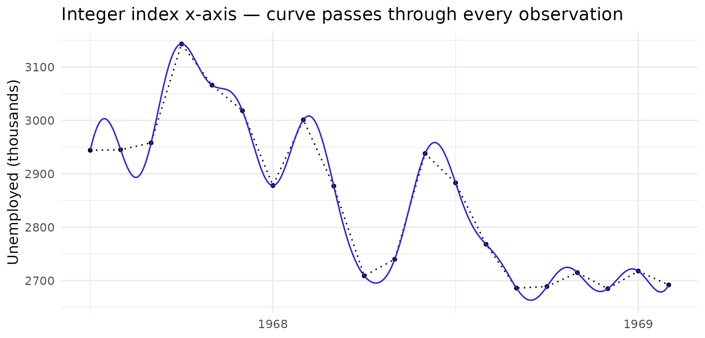

The Fourier curve now interpolates the data exactly. When working with
any irregularly-spaced time series — monthly, weekly, or business-day —
convert the time variable to a sequential integer index before passing
it to
[`geom_fourier()`](https://flrd.github.io/ggpointless/dev/reference/geom_fourier.md)
or
[`stat_fourier()`](https://flrd.github.io/ggpointless/dev/reference/geom_fourier.md).

## geom_lexis & stat_lexis

[`geom_lexis()`](https://flrd.github.io/ggpointless/dev/reference/geom_lexis.md)
draws a 45° lifeline for each observation from its start to its end. The
required aesthetics are `x` and `xend`; `y` and `yend` are calculated by
[`stat_lexis()`](https://flrd.github.io/ggpointless/dev/reference/geom_lexis.md)
and represent the cumulative duration.

``` r
df_l <- data.frame(
  key  = c("A", "B", "B", "C", "D"),
  x    = c(0, 1, 6, 5, 6),
  xend = c(5, 4, 10, 8, 10)
)

p <- ggplot(df_l, aes(x = x, xend = xend, colour = key)) +
  coord_equal()

p + geom_lexis()
```

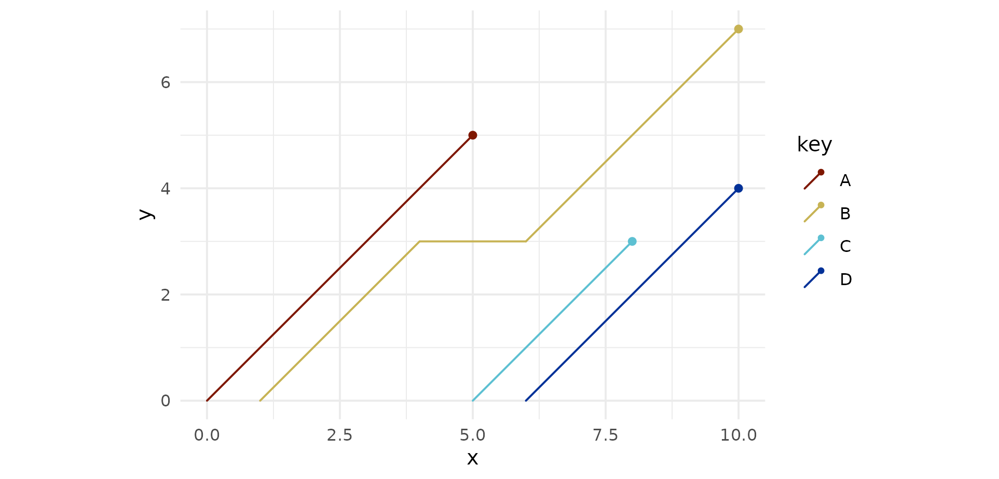

When there is a gap between two events of the same cohort, a horizontal
dotted segment bridges the gap. Set `gap_filler = FALSE` to hide it.

``` r
p + geom_lexis(gap_filler = FALSE)
```

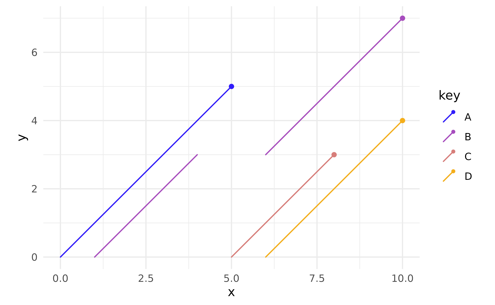

### Using after_stat(type) and custom point styling

The computed variable `type` takes the value `"solid"` for 45° lifelines
and `"dotted"` for horizontal gap-fillers. Map it to `linetype` to make
the distinction explicit, and use `point_colour` to style the endpoint
dot independently of the lifeline colour.

``` r
p +
  stat_lexis(
    aes(linetype = after_stat(type)),
    point_colour = "#333333",
    shape        = 21,
    fill         = "white",
    size         = 2.5,
    stroke       = 0.8
  ) +
  scale_linetype_identity()
```

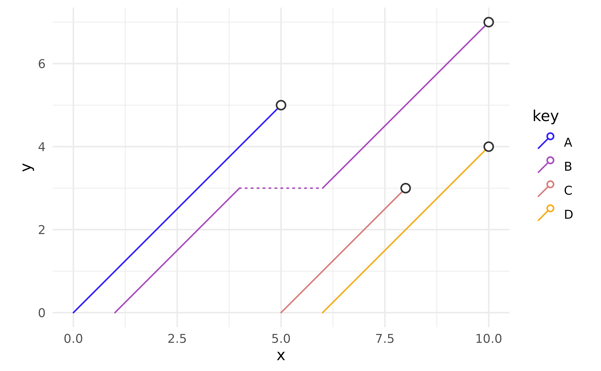

### Date and POSIXct classes

[`geom_lexis()`](https://flrd.github.io/ggpointless/dev/reference/geom_lexis.md)
works with Date and POSIXct objects as well as numerics. The y-axis
shows duration in the native unit of the scale (days for Date, seconds
for POSIXct).

``` r
df_dates <- data.frame(
  key   = c("A", "B"),
  start = c(2019, 2021),
  end   = c(2022, 2022)
)
df_dates[, c("start", "end")] <- lapply(
  df_dates[, c("start", "end")],
  function(i) as.Date(paste0(i, "-01-01"))
)

ggplot(df_dates, aes(x = start, xend = end, group = key)) +
  geom_lexis() +
  scale_y_continuous(
    breaks = 0:3 * 365.25,
    labels = \(i) paste0(floor(i / 365.25), " yr")
  ) +
  coord_fixed() +
  labs(y = "Duration")
```

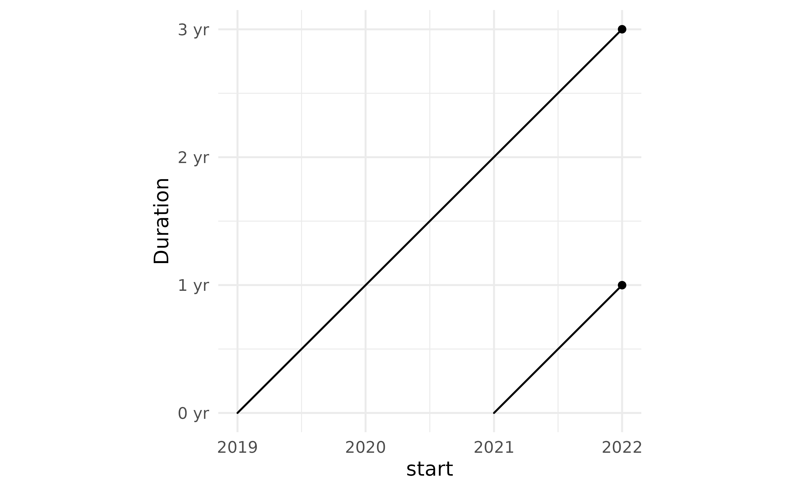

## geom_point_glow

[`geom_point_glow()`](https://flrd.github.io/ggpointless/dev/reference/geom_point_glow.md)
is a drop-in replacement for
[`geom_point()`](https://ggplot2.tidyverse.org/reference/geom_point.html)
that adds a radial gradient glow behind each point using
[`grid::radialGradient()`](https://rdrr.io/r/grid/patterns.html). It
shines brightest on dark backgrounds.

### Ursa Major

The constellation Ursa Major, drawn with star positions in right
ascension and declination:

``` r
# Precise J2000 coordinates (Hipparcos / SIMBAD) and apparent magnitudes
# from the Wikipedia Großer Bär star table.
stars_base <- data.frame(
  star = c(
    "Dubhe", "Merak", "Phecda", "Megrez", "Alioth", "Mizar", "Alkaid",
    "Muscida", "23 UMa", "Upsilon", "Phi", "Theta",
    "Talitha", "Alkaphrah",
    "Chi", "Psi", "Tania Borealis", "Tania Australis",
    "Alula Borealis", "Alula Australis"
  ),
  ra_h = c(
    11.062, 11.031, 11.897, 12.257, 12.900, 13.399, 13.792,
    8.504, 9.526, 9.850, 9.868, 9.548,
    8.987, 9.060,
    11.767, 11.161, 10.285, 10.372,
    11.308, 11.303
  ),
  dec_d = c(
    61.75, 56.38, 53.70, 57.03, 55.96, 54.93, 49.31,
    60.72, 63.06, 59.04, 54.06, 51.68,
    48.04, 47.16,
    47.78, 44.50, 42.91, 41.50,
    33.09, 31.53
  ),
  # Apparent visual magnitudes (Wikipedia / Bright Star Catalogue).
  # Alioth is slightly variable; 1.77 is the mean.
  mag = c(
    1.81, 2.34, 2.41, 3.32, 1.77, 2.23, 1.86,
    3.35, 3.65, 3.78, 4.55, 3.20,
    3.12, 3.57,
    3.69, 3.00, 3.45, 3.06,
    3.49, 3.79
  )
)

# Linear size mapping: brighter (lower mag) → larger point
mag_to_size <- function(m) pmax(0.7, (5.5 - m) * 1.0)

# Constellation figure lines (IAU official figure):
# Big Dipper (bowl closed, then handle)
path1 <- c("Alkaid", "Mizar", "Alioth", "Megrez", "Phecda", "Merak", "Dubhe", "Megrez")
# Head + neck → front shoulder junction
path2 <- c("Dubhe", "23 UMa", "Muscida", "Upsilon", "Theta")
# Belly (Merak) to front-leg junction
path3 <- c("Merak", "Upsilon")
# Front paw pair
path4 <- c("23 UMa", "Upsilon", "Theta", "Alkaphrah", "Talitha")
# Hind leg → Alula paw pair
path5 <- c("Phecda", "Chi", "Alula Borealis", "Alula Australis")
# Hind leg branch → Tania paw pair
path6 <- c("Chi", "Psi", "Tania Australis", "Tania Borealis")

make_path <- function(star_names, group_id) {
  df <- stars_base[match(star_names, stars_base$star), ]
  df$group <- group_id
  df
}

plot_data <- rbind(
  make_path(path1, 1),
  make_path(path2, 2),
  make_path(path3, 3),
  make_path(path4, 4),
  make_path(path5, 5),
  make_path(path6, 6)
)
plot_data$x <- -plot_data$ra_h
plot_data$y <- plot_data$dec_d

ggplot(plot_data, aes(x = x, y = y)) +
  geom_path(aes(group = group), colour = "#F5F5F5", linewidth = 0.6, alpha = .6) +
  geom_point_glow(
    data        = stars_base,
    aes(x = -ra_h, y = dec_d, size = mag_to_size(mag)),
    shape       = 8,
    colour      = ggplot2::alpha("#F5F5F5", alpha = .6),
    glow_colour = "#F5F5F5",
    glow_alpha  = 0.75
  ) +
  scale_size_identity() +
  geom_text(
    data = stars_base,
    aes(x = -ra_h, y = dec_d, label = star),
    colour = "#bbccdd",
    vjust = -1.2,
    size = 2.5,
    check_overlap = TRUE
  ) +
  scale_x_continuous(
    breaks = seq(-14, -8, by = 1),
    labels = \(x) paste0(abs(x), "h")
  ) +
  scale_y_continuous(labels = \(x) paste0(x, "°")) +
  labs(
    title = "Ursa Major",
    x     = NULL,
    y     = NULL
  ) +
  theme(
    panel.background = element_rect(fill = grid::linearGradient(colours = c("#081849", "#070836")), colour = NA),
    plot.background  = element_rect(fill = grid::linearGradient(colours = c("#081849", "#070836")), colour = NA),
    panel.grid.major = element_line(colour = "#1e2f3e", linetype = "dotted"),
    panel.grid.minor = element_blank(),
    text             = element_text(colour = "#344B73"),
    plot.title       = element_text(size = 14, face = "bold")
  )
```

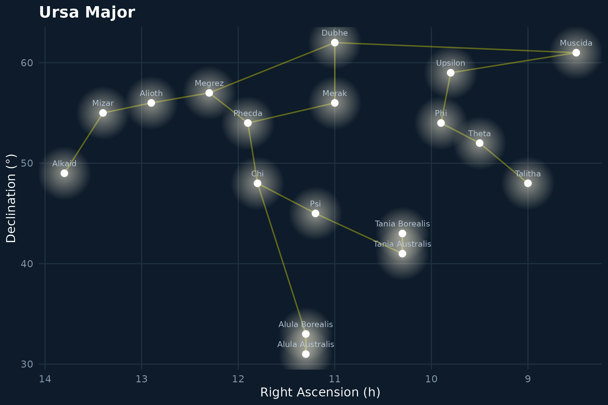

## geom_pointless & stat_pointless

[`geom_pointless()`](https://flrd.github.io/ggpointless/dev/reference/geom_pointless.md)
highlights selected observations — first, last, minimum, maximum, or all
four — by default with points. Its name reflects that it is not
particularly useful on its own, but in conjunction with
[`geom_line()`](https://ggplot2.tidyverse.org/reference/geom_path.html)
and friends, it adds useful context at a glance.

``` r
x <- seq(-pi, pi, length.out = 100)
df1 <- data.frame(var1 = x, var2 = rowSums(outer(x, 1:5, \(x, y) sin(x * y))))

p <- ggplot(df1, aes(x = var1, y = var2)) +
  geom_line()

p + geom_pointless(location = "all", size = 3)
```

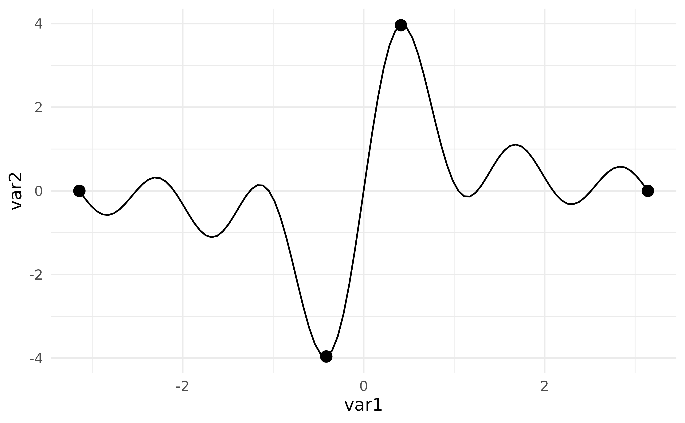

Map the computed variable `location` to `colour` to distinguish the four
roles:

``` r
p +
  geom_pointless(
    aes(colour = after_stat(location)),
    location = "all",
    size = 3
  ) +
  theme(legend.position = "bottom")
```

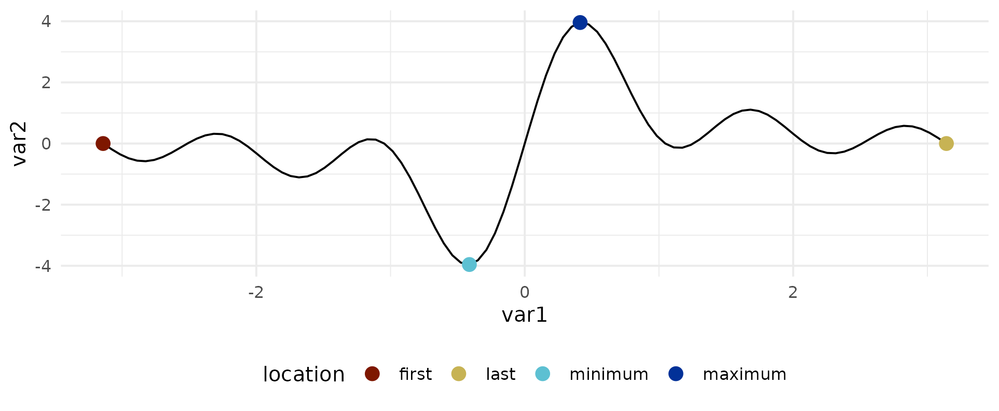

### Order and orientation

Locations are determined in data order, as
[`geom_path()`](https://ggplot2.tidyverse.org/reference/geom_path.html)
would — not sorted by x like
[`geom_line()`](https://ggplot2.tidyverse.org/reference/geom_path.html).
This matters when the path crosses itself:

``` r
x <- seq(5, -1, length.out = 1000) * pi
spiral <- data.frame(var1 = sin(x) * 1:1000, var2 = cos(x) * 1:1000)

p_spi <- ggplot(spiral) +
  geom_path() +
  coord_equal(xlim = c(-1000, 1000), ylim = c(-1000, 1000)) +
  theme(legend.position = "none")

p_spi +
  aes(x = var1, y = var2) +
  geom_pointless(aes(colour = after_stat(location)), location = "all", size = 3) +
  labs(subtitle = "orientation = 'x'")

p_spi +
  aes(y = var1, x = var2) +
  geom_pointless(aes(colour = after_stat(location)), location = "all", size = 3) +
  labs(subtitle = "orientation = 'y'")
```

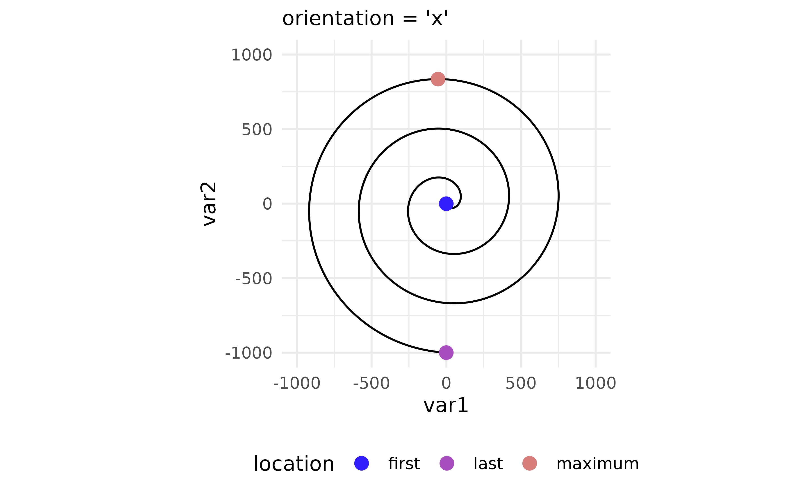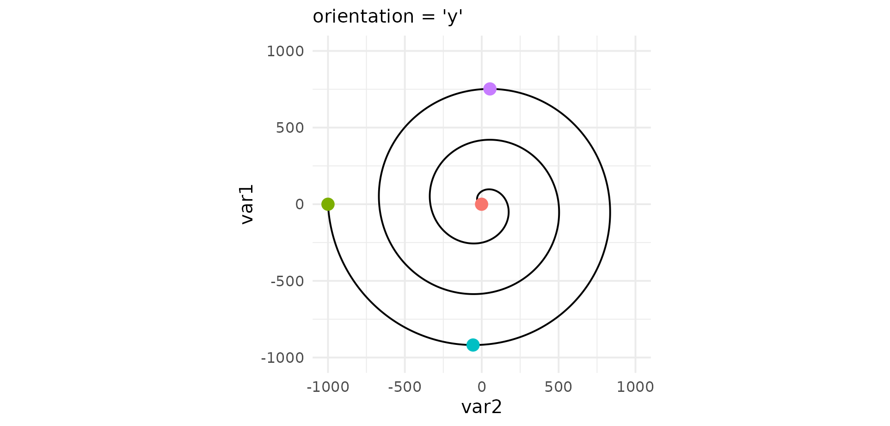

When `location = "all"`, points are drawn bottom to top in the order:
`"maximum"` \< `"minimum"` \< `"last"` \< `"first"`. Passing an explicit
vector lets you override this:

``` r
df2 <- data.frame(x = 1:2, y = 1:2)
p2 <- ggplot(df2, aes(x, y)) +
  geom_path() +
  coord_equal()

p2 + geom_pointless(aes(colour = after_stat(location)),
  location = c("first", "last", "minimum", "maximum"), size = 4
) +
  labs(subtitle = "first on top")

p2 + geom_pointless(aes(colour = after_stat(location)),
  location = c("maximum", "minimum", "last", "first"), size = 4
) +
  labs(subtitle = "maximum on top")
```

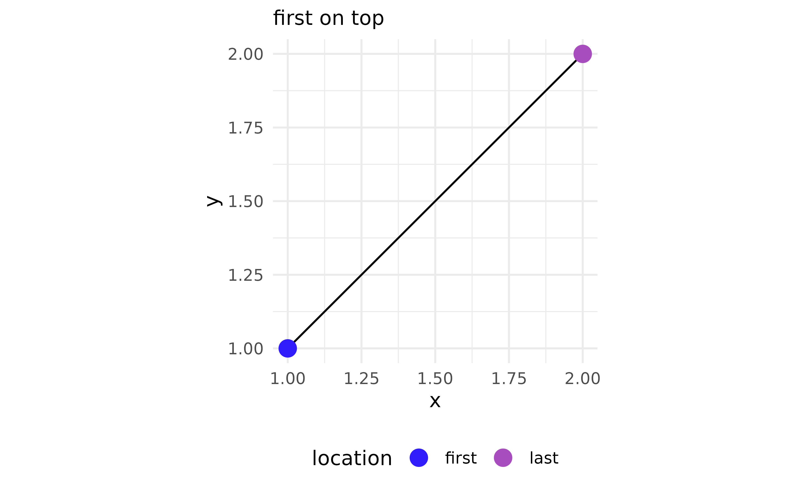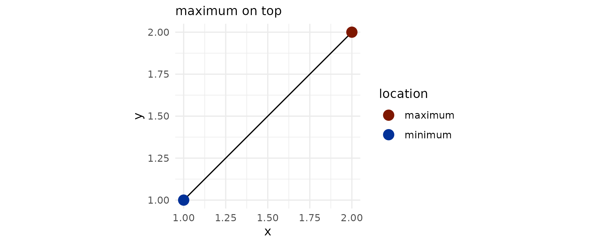

[`geom_pointless()`](https://flrd.github.io/ggpointless/dev/reference/geom_pointless.md)
respects `ggplot2`’s group structure and works naturally with facets:

``` r
ggplot(
  subset(economics_long, variable %in% c("psavert", "unemploy")),
  aes(x = date, y = value)
) +
  geom_line(colour = "#333333") +
  geom_pointless(
    aes(colour = after_stat(location)),
    location = c("minimum", "maximum"),
    size = 2
  ) +
  stat_pointless(location = "minimum", geom = "text", aes(label = after_stat(y)), hjust = -1) +
  facet_wrap(vars(variable), ncol = 1, scales = "free_y") +
  theme(legend.position = "bottom") +
  labs(x = NULL, y = NULL, colour = NULL)
```

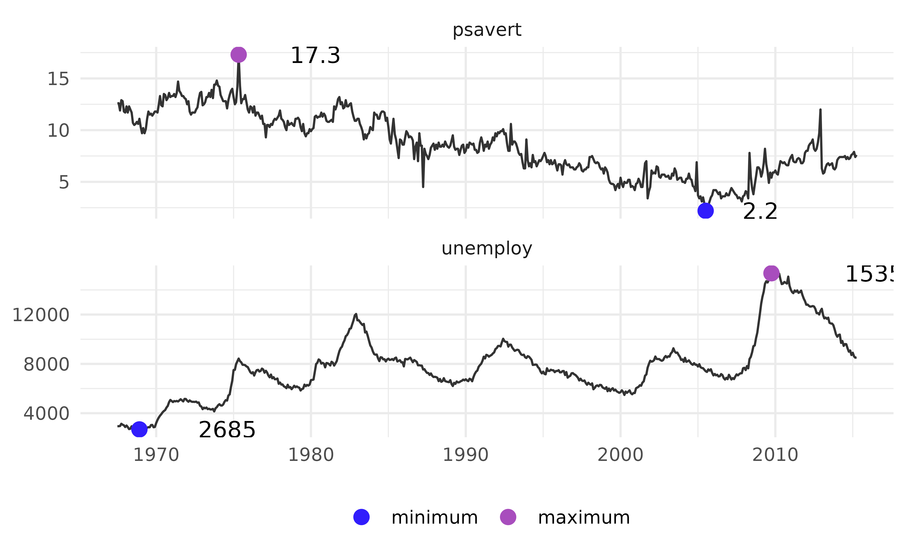

Here it adds horizontal reference lines at the minimum and maximum:

``` r
set.seed(42)
df3 <- data.frame(x = 1:10, y = sample(10))

ggplot(df3, aes(x, y)) +
  geom_line() +
  stat_pointless(
    aes(yintercept = y, colour = after_stat(location)),
    location = c("minimum", "maximum"),
    geom = "hline"
  ) +
  theme(legend.position = "bottom")
```

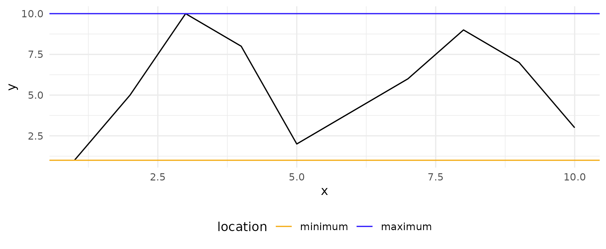
