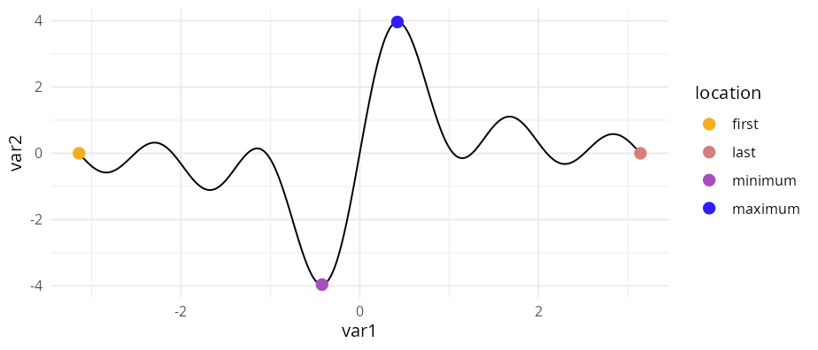
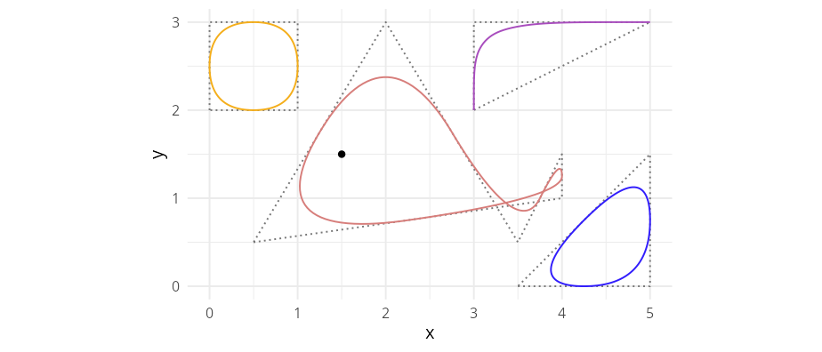
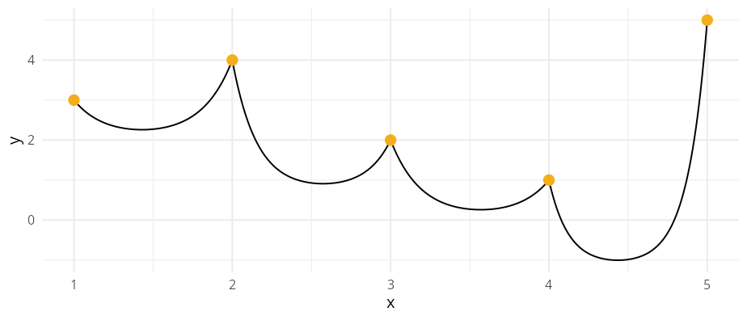

# ggpointless

`ggpointless` is an extension of the
[`ggplot2`](https://ggplot2.tidyverse.org/) library providing additional
layers.

## Installation

You can install `ggpointless` from CRAN with:

``` r
install.packages("ggpointless")
```

To install the development version from [GitHub](https://github.com/)
use:

``` r
# install.packages("devtools")
devtools::install_github("flrd/ggpointless")
```

Once you have installed the package, attach it by calling:

``` r
library(ggpointless)
```

## What will you get

This package is a collection of geoms, and stats for
[ggplot2](https://ggplot2.tidyverse.org/). The following functions are
implemented:

- [`geom_arch()`](https://flrd.github.io/ggpointless/dev/reference/geom_catenary.md)
  &
  [`stat_arch()`](https://flrd.github.io/ggpointless/dev/reference/geom_catenary.md)
  – draws an inverted catenary curve
- [`geom_area_fade()`](https://flrd.github.io/ggpointless/dev/reference/geom_area_fade.md)
  – area plots wiht gradient fill
- [`geom_catenary()`](https://flrd.github.io/ggpointless/dev/reference/geom_catenary.md)
  &
  [`stat_catenary()`](https://flrd.github.io/ggpointless/dev/reference/geom_catenary.md)
  – draws a catenary curve
- [`geom_chaikin()`](https://flrd.github.io/ggpointless/dev/reference/geom_chaikin.md)
  &
  [`stat_chaikin()`](https://flrd.github.io/ggpointless/dev/reference/geom_chaikin.md)
  – applies Chaikin’s corner cutting algorithm
- [`geom_fourier()`](https://flrd.github.io/ggpointless/dev/reference/geom_fourier.md)
  &
  [`stat_fourier()`](https://flrd.github.io/ggpointless/dev/reference/geom_fourier.md)
  – fits a Fourier series to `x`/`y` and renders the reconstructed curve
- [`geom_lexis()`](https://flrd.github.io/ggpointless/dev/reference/geom_lexis.md)
  &
  [`stat_lexis()`](https://flrd.github.io/ggpointless/dev/reference/geom_lexis.md)
  – draws a Lexis diagram
- [`geom_point_glow()`](https://flrd.github.io/ggpointless/dev/reference/geom_point_glow.md)
  – adds a radial gradient to your point plots
- [`geom_pointless()`](https://flrd.github.io/ggpointless/dev/reference/geom_pointless.md)
  &
  [`stat_pointless()`](https://flrd.github.io/ggpointless/dev/reference/geom_pointless.md)
  – emphasizes some observations with points

See
[`vignette("ggpointless")`](https://flrd.github.io/ggpointless/articles/ggpointless.html)
for details and examples.

### geom_area_fade

This geom behaves like
[geom_area()](https://ggplot2.tidyverse.org/reference/geom_ribbon.html?q=geom_area#null)
does except it uses
[grid::linearGradient()](https://search.r-project.org/CRAN/refmans/gridSVG/html/gradients.html)
to fill the area.

``` r
cols <- c("#f4ae1b", "#d77e7b", "#a84dbd", "#311dfc")
theme_set(theme_minimal())

library(ggplot2)
df <- data.frame(
 g = c("a", "a", "a", "b", "b", "b"),
 x = c(1, 3, 5, 2, 4, 6),
 y = c(2, 5, 1, 3, 6, 7)
)

ggplot(df, aes(x, y, fill = g)) +
 geom_area_fade()
```


### geom_pointless

[`geom_pointless()`](https://flrd.github.io/ggpointless/dev/reference/geom_pointless.md)
let’s you highlight the first, or last observations, sample minimum and
sample maximum to provide additional context. Or just some visual sugar.
[`geom_pointless()`](https://flrd.github.io/ggpointless/dev/reference/geom_pointless.md)
behaves similar to
[`geom_point()`](https://ggplot2.tidyverse.org/reference/geom_point.html)
except that it has a `location` argument. You can set it to `"first"`,
`"last"` (default), `"minimum"`, `"maximum"`, and `"all"`, where `"all"`
is just shorthand to select `"first"`, `"last"`, `"minimum"` and
`"maximum"`.

``` r
x <- seq(-pi, pi, length.out = 500)
y <- outer(x, 1:5, function(x, y) sin(x * y))

df1 <- data.frame(
  var1 = x,
  var2 = rowSums(y)
)

ggplot(df1, aes(x = var1, y = var2)) +
  geom_line() +
  geom_pointless(aes(color = after_stat(location)),
    location = "all",
    size = 3
  ) +
  scale_color_manual(values = cols)
```



### geom_lexis

[`geom_lexis()`](https://flrd.github.io/ggpointless/dev/reference/geom_lexis.md)
is a combination of a segment and a point layer. Given a start value and
an end value, this function draws a 45° line which indicates the
duration of an event. Required are `x` and `xend` aesthetics, `y` and
`yend` coordinates will be calculated.

``` r
df2 <- data.frame(
  key = c("A", "B", "B", "C", "D"),
  x = c(0, 1, 6, 5, 6),
  xend = c(5, 4, 10, 8, 10)
)

ggplot(df2, aes(x = x, xend = xend, color = key)) +
  geom_lexis(aes(linetype = after_stat(type)), size = 2) +
  coord_equal() +
  scale_x_continuous(breaks = c(df2$x, df2$xend)) +
  scale_color_manual(values = cols) +
  scale_linetype_identity() +
  theme(panel.grid.minor = element_blank())
```


See also the [`LexisPlotR`
package](https://github.com/ottlngr/LexisPlotR).

### geom_chaikin

Chaikin’s corner cutting algorithm let’s you turn a ragged path or
polygon into a smoothed one. Credit to [Farbfetzen /
corner_cutting](https://github.com/Farbfetzen/corner_cutting).

``` r
lst <- list(
  data = list(
    closed_square = data.frame(x = c(0, 0, 1, 1), y = c(2, 3, 3, 2)),
    whale = data.frame(x = c(.5, 4, 4, 3.5, 2), y = c(.5, 1, 1.5, .5, 3)),
    open_triangle = data.frame(x = c(3, 3, 5), y = c(2, 3, 3)),
    closed_triangle = data.frame(x = c(3.5, 5, 5), y = c(0, 0, 1.5))
  ),
  color = cols,
  closed = c(TRUE, TRUE, FALSE, TRUE)
)

ggplot(mapping = aes(x, y)) +
  lapply(lst$data, function(i) {
    geom_polygon(data = i, fill = NA, linetype = "12", color = "#777777")
  }) +
  Map(f = function(data, color, closed) {
    geom_chaikin(data = data, color = color, closed = closed)
  }, data = lst$data, color = lst$color, closed = lst$closed) +
  geom_point(data = data.frame(x = 1.5, y = 1.5)) +
  coord_equal()
```



See also the [`smoothr` package](https://github.com/mstrimas/smoothr/).

### geom_catenary

Draws a flexible curve that simulates a chain or rope hanging loosely
between two fixed points. By default, a chain length twice the Euclidean
distance between each x/y combination is used. See
[`vignette("ggpointless")`](https://flrd.github.io/ggpointless/articles/ggpointless.html)
for details.

Credit to:
[dulnan/catenary-curve](https://github.com/dulnan/catenary-curve)

``` r
ggplot(data.frame(x = 1:5, y = sample(5)),
       aes(x, y)) + 
  geom_catenary() +
  geom_point(size = 3, colour = "#f4ae1b")
```



## Code of Conduct

Please note that this project is released with a [Contributor Code of
Conduct](https://github.com/flrd/ggpointless/blob/main/CODE_OF_CONDUCT.md).
By participating in this project you agree to abide by its terms.
