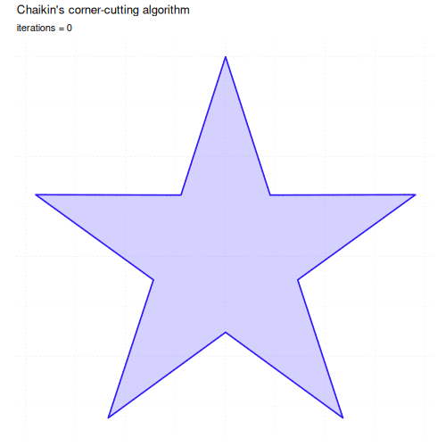

```{r setup, include = FALSE}
knitr::opts_chunk$set(
  collapse  = TRUE,
  comment   = "#>",
  dev       = "ragg_png",
  dpi       = 300,
  fig.asp   = 0.618,
  fig.width = 6,
  fig.height = 3,
  fig.align = "center",
  out.width = "80%"
)
```

```{=html}
<style>
  .content h3 {
    margin-top: -30px !important;
  }

  details {
    margin-bottom: 40px;
  }
</style>
```

This article walks through every layer function in `ggpointless`. The package
groups its layers into two broad categories:

- **Data transformations** — geoms backed by a stat that fits or
  transforms data.
- **Visual effects** — drop-in replacements for `ggplot2` layers
  with extra visual flair: alpha gradients, glows, fading reference lines.
  These do not add statistical meaning; they re-render the same data but give
  you some additional features to change the appearance of your data.

> **Note on devices**: Most R graphics devices ship with gradient support
> (ragg, Cairo-backed PNG on Linux/macOS, SVG). The notable exception is
> `grDevices::pdf()`, on which the fade family falls back to flat
> semi-transparent fills.

## Setup

```{r setup-theme, warning=FALSE}
library(ggpointless)

# Brand palette -- kept in sync with the README
cols <- c("#311dfc", "#a84dbd", "#d77e7b", "#f4ae1b")
theme_set(
  theme_minimal() +
    theme(
      legend.position           = "bottom",
      geom                      = element_geom(fill = cols[1]),
      palette.fill.discrete     = cols,
      palette.colour.discrete   = cols,
      palette.fill.continuous   = cols,
      palette.colour.continuous = cols
    )
)
```

## Statistical transformations

## geom_arch() and geom_catenary()

A **catenary** is the curve formed by a flexible chain or cable hanging
freely between two fixed supports. It follows this equation:

$$y = a \cosh\!\left(\frac{x}{a}\right)$$

`geom_catenary()` draws a hanging-chain catenary curve between successive
points; `geom_arch()` draws a catenary arch, i.e. the inverted curve.

### geom_arch
The shape is controlled by `arch_length` or `arch_height` (vertical rise above
the highest endpoint of each segment). By default the arc length is twice
the Euclidean distance calculated for each segment.

```{r arch-basic, fig.height = 3, fig.alt = "Single arched curve rising between two points on a flat baseline."}
ggplot(data.frame(x = 1:2, y = c(0, 0)), aes(x, y)) +
  geom_arch(arch_height = 0.6)
```

`stat_arch()` exposes the underlying computation. Here it shows the effect of
different `arch_height` values between the same two endpoints:

```{r stat-arch-compare, fig.height = 3.5, fig.alt = "Three arches of increasing height drawn between the same two endpoints, distinguished by colour."}
ggplot(data.frame(x = c(0, 2), y = c(0, 0)), aes(x, y)) +
  lapply(c(0.5, 1.5, 3), \(ah) {
    stat_arch(arch_height = ah, aes(colour = paste0("arch_height = ", ah)))
  }) +
  labs(colour = NULL)
```

A real-world application is the **[Rice House](https://en.wikipedia.org/wiki/Rice_House,_Eltham)**
in Eltham, whose distinctive roofline consists of shallow catenary arched
spans rising above vertical columns. The sketch below reconstructs its simplified
cross-section:

```{r rice-house, fig.height = 3, fig.alt = "Simplified cross-section of the Rice House roof showing three shallow catenary arches resting on vertical columns above a green ground line."}
rice_house <- data.frame(
  x = c(0, 1.5, 2.5, 3.5, 5),
  y = c(0, 1, 1, 1, 0)
)

ggplot(rice_house, aes(x, y)) +
  geom_arch(arch_height = 0.15, linewidth = 2, colour = "#333333") +
  geom_segment(aes(xend = x, yend = 0), colour = "#333333") +
  geom_hline(yintercept = 0, colour = "#4a7c59", linewidth = 3) +
  coord_equal() +
  theme_void() +
  labs(caption = "Rice House, Eltham (simplified catenary cross-section)")
```

### geom_catenary

`geom_catenary()` draws the hanging-chain form between successive points.

```{r catenary-basic, fig.height = 3, fig.alt = "Hanging-chain catenary curves connecting six scattered points, with the points marked in dark grey."}
set.seed(1)
ggplot(data.frame(x = 1:6, y = sample(6)), aes(x, y)) +
  geom_catenary() +
  geom_point(size = 3, colour = "#333333")
```

By default the chain length is twice the Euclidean distance per segment. Pass
`chain_length` to set an explicit arc length — longer values make the chain sag
more. If the value is shorter than the straight-line distance a warning is
issued and a straight line is drawn instead.

```{r catenary-chain-length, fig.height = 3, fig.alt = "Three catenary curves between the same two points, sagging progressively more as the chain length increases."}
ggplot(data.frame(x = c(0, 1), y = c(1, 1)), aes(x, y)) +
  lapply(c(1.5, 1.75, 2), \(cl) {
    geom_catenary(chain_length = cl)
  }) +
  ylim(0, 1.05)
```

`sag` sets the vertical drop below the lowest endpoint of each segment, giving
you direct control over how much the chain droops:

```{r catenary-sag, fig.height = 3, fig.alt = "Three catenary curves linking four points at the same height, each with a different vertical sag."}
df_sag <- data.frame(x = c(0, 2, 4, 6), y = c(1, 1, 1, 1))

ggplot(df_sag, aes(x, y)) +
  geom_catenary(sag = c(0.1, 0.5, 1.2)) +
  geom_point(size = 3, colour = "#333333")
```

`chain_length` and `sag` can be mixed per segment by placing `NA` in the
position where the other argument should win. When both are non-`NA` for the
same segment, `sag` takes precedence.

```{r catenary-sag-vs-chain-length, fig.height = 3, fig.alt = "Three catenary curves between four equally-spaced points, mixing chain-length and sag arguments per segment."}
df_sag <- data.frame(x = c(0, 2, 4, 6), y = c(1, 1, 1, 1))

ggplot(df_sag, aes(x, y)) +
  geom_catenary(
    chain_length = c(2, NA, 3),
    sag = c(0.1, 0.5, NA)
  ) +
  geom_point(size = 3, colour = "#333333") +
  ylim(c(-.25, 1))
```

## geom_chaikin

Chaikin's corner-cutting algorithm smooths a polygonal path by iteratively
replacing each corner with two new points placed at a given ratio along the
adjacent edges. With `ratio = 0.25` (the default) and `iterations = 5` the
path converges to a smooth B-spline approximation.

```{r chaikin-basic, fig.height = 3, fig.alt = "A jagged dashed line of ten random points with a smoothed Chaikin curve following the same trajectory."}
set.seed(42)
dat <- data.frame(x = seq.int(10), y = sample(15:30, 10))

ggplot(dat, aes(x, y)) +
  geom_line(linetype = "dashed", colour = "#333333") +
  geom_chaikin(colour = cols[1])
```

`ratio` controls how aggressively corners are cut. At `ratio = 0.5` the new
points coincide with the edge midpoints, producing the maximum rounding
possible in a single pass.

```{r chaikin-ratio, fig.height = 3, fig.alt = "A dashed triangle outline with three Chaikin-smoothed closed curves inside, showing how larger ratios round the corners more aggressively."}
triangle <- data.frame(x = c(0, 0.5, 1), y = c(0, 1, 0))

ggplot(triangle, aes(x, y)) +
  geom_polygon(fill = NA, colour = "grey70", linetype = "dashed") +
  lapply(c(0.1, 0.25, 0.5), \(r) {
    geom_chaikin(ratio = r, mode = "closed", aes(colour = paste0("ratio = ", r)))
  }) +
  labs(colour = NULL) +
  coord_equal()
```

### Effect of iterations

Each iteration halves the sharpness of every corner.
The `r if (identical(Sys.getenv("IN_PKGDOWN"), "true")) "animation" else "plot"`
below `r if (identical(Sys.getenv("IN_PKGDOWN"), "true")) "steps through iterations = 0, 1, 2, 3, 5, and 10" else "shows iterations = 3"`, applied to a five-pointed star. `r if (!identical(Sys.getenv("IN_PKGDOWN"), "true")) "See the [package website](https://flrd.github.io/ggpointless/articles/ggpointless.html#effect-of-iterations) for an animated version."`

```{r chaikin-iterations-gif, echo=FALSE, out.width="60%", eval=identical(Sys.getenv("IN_PKGDOWN"), "true"), fig.alt = "Animation of a five-pointed star being progressively rounded by successive Chaikin iterations."}

```

```{r chaikin-iterations-static, echo=FALSE, fig.height = 3, fig.align="center", eval=!identical(Sys.getenv("IN_PKGDOWN"), "true"), fig.alt = "A dotted five-pointed star outline with a softer, rounded version filled in blue after three Chaikin iterations."}
n_pts   <- 5L
outer_r <- 1
inner_r <- 0.38
ang_out <- seq(pi / 2, pi / 2 + 2 * pi, length.out = n_pts + 1L)[seq_len(n_pts)]
ang_in  <- ang_out + pi / n_pts
star <- data.frame(
  x = c(rbind(outer_r * cos(ang_out), inner_r * cos(ang_in))),
  y = c(rbind(outer_r * sin(ang_out), inner_r * sin(ang_in)))
)

ggplot(star, aes(x, y)) +
  geom_polygon(
    fill = NA, colour = "#333333", linetype = "dotted", linewidth = 0.55
  ) +
  stat_chaikin(
    geom = "polygon", mode = "closed", iterations = 3,
    fill = "#311dfc", alpha = 0.20, colour = "#311dfc", linewidth = 0.8
  ) +
  coord_equal(clip = "off") +
  labs(x = NULL, y = NULL) +
  theme_minimal() +
  theme(
    panel.grid = element_line(linetype = "dotted"),
    axis.text  = element_blank(),
    axis.ticks = element_blank()
  )
```

The source script that generates the animation is `inst/scripts/gen_chaikin_gif.R`.

## geom_fourier

`geom_fourier()` fits a Fourier series (via
[fft()](https://search.r-project.org/R/refmans/stats/html/fft.html)) to the
supplied `x`/`y` observations and renders the reconstructed smooth curve. By
default all harmonics up to the Nyquist limit are used, giving an exact
interpolating fit.

```{r fourier-anim, echo=FALSE, out.width="100%", fig.cap="", fig.alt="Animation of a Fourier reconstruction of a square wave, accumulating harmonics one at a time."}
knitr::include_graphics("figures/fourier_square_wave.gif")
```

> The source script that generates the animation is at `inst/scripts/gen_fourier_gif.R`.

Reducing `n_harmonics` progressively smooths the result. Fewer harmonics
produce a smoother, low-frequency summary; retaining all harmonics
reproduces the original signal exactly (up to interpolation artefacts).

```{r fourier-harmonics, fig.height = 3.5, fig.alt = "Scattered noisy points fitted by two Fourier reconstructions, one using a single harmonic and a smoother one using three harmonics."}
set.seed(42)
n <- 150
df_f <- data.frame(
  x = seq(0, 2 * pi, length.out = n),
  y = sin(seq(0, 2 * pi, length.out = n)) +
    0.4 * sin(3 * seq(0, 2 * pi, length.out = n)) +
    rnorm(n, sd = 0.25)
)

ggplot(df_f, aes(x, y)) +
  geom_point(alpha = 0.25) +
  lapply(c(1, 3), \(nh) {
    geom_fourier(aes(colour = paste0("n_harmonics = ", nh)), n_harmonics = nh)
  }) +
  labs(colour = NULL)
```

### Detrending

A linear drift in the data will dominate the low-frequency coefficients,
preventing the Fourier series from capturing the periodic structure. Set
`detrend = "lm"` (or `"loess"`) to subtract the trend before the transform;
it is added back afterwards so the output remains on the original scale.

```{r fourier-detrend, fig.height = 3.5, fig.alt = "Upward-drifting noisy points compared with two Fourier fits, one without detrending that misses the periodic structure and one with linear detrending that captures the oscillation atop the rising trend."}
set.seed(3)
x_d <- seq(0, 4 * pi, length.out = 100)
df_d <- data.frame(
  x = x_d,
  y = sin(x_d) + x_d * 0.4 + rnorm(100, sd = 0.2)
)

ggplot(df_d, aes(x, y)) +
  geom_point(alpha = 0.35) +
  geom_fourier(aes(colour = "detrend = NULL"),
    n_harmonics = 3
  ) +
  geom_fourier(
    aes(colour = "detrend = \"lm\""),
    n_harmonics = 3,
    detrend = "lm") +
  labs(
    x = NULL, y = NULL
  )
```

## geom_gridline

`geom_gridline()` draws panel grid lines as a regular layer, so they can sit *on
top* of other layers instead of disappearing behind them. Line styling falls
through from `theme(panel.grid.*)` for any property you don't explicitly 
override. To remove the underlying theme grid (so the layer's lines don't stack with
`ggplot2`'s own grid) add `+ theme(panel.grid = element_blank())`.

```{r gridline-basic, fig.height = 3, fig.alt = "Bar chart of vehicle counts by class with horizontal gridlines drawn on top of the bars."}
ggplot(mpg, aes(class)) +
  geom_bar() +
  geom_gridline()
```

### Picking axes

Use `grids = "x"`, `"y"`, or `c("x", "y")` to choose which axis to draw, and
`lines = c('major', 'minor')` to draw minor (grid-)lines too. Positions come
from the trained scale — no manual breaks needed.

```{r gridline-axes, fig.height = 3.5, fig.alt = "Horizontal bar chart of vehicle counts on a log-scaled x-axis with major and minor vertical gridlines drawn on top."}
ggplot(mpg, aes(y = class)) +
  geom_bar() +
  geom_gridline(grids = "x", lines = c("major", "minor")) +
  scale_x_log10()
```

But you can of course add breaks whenever you want and `geom_gridline()` picks
these values up automatically.

```{r gridline-axes-log10, fig.height = 3.5, fig.alt = "Horizontal bar chart on a log-scaled x-axis with thick gold custom-positioned gridlines at the breaks 5, 10 and 20."}
ggplot(mpg, aes(y = class)) +
  geom_bar() +
  geom_gridline(
    grids = "x",
    linewidth = 2,
    colour = cols[4]
    ) +
  scale_x_log10(breaks = c(5, 10, 20))
```

### Polar coordinates

`geom_gridline()` works under `coord_polar()` and `coord_radial()` too.

```{r gridline-polar, fig.height = 3.5, fig.alt = "Stacked polar bar chart of cylinder counts with radial and angular gridlines overlaid."}
ggplot(mtcars, aes(x = factor(1), fill = factor(cyl))) +
  geom_bar(width = 1) +
  geom_gridline(grids = c("x", "y"), lines = c("major", "minor")) +
  coord_polar(theta = "y") +
  theme_void()
```

## geom_lexis

`geom_lexis()` draws a 45° lifeline for each observation from its start to its
end. The required aesthetics are `x` and `xend`; `y` and `yend` are calculated
by `stat_lexis()` and represent the cumulative duration.

```{r lexis-basic, fig.height = 3.5, fig.alt = "Lexis diagram with four cohorts drawn as 45-degree lifelines, with horizontal dotted segments bridging gaps within the same cohort."}
df_l <- data.frame(
  key  = c("A", "B", "B", "C", "D"),
  x    = c(0, 1, 6, 5, 6),
  xend = c(5, 4, 10, 8, 10)
)

p <- ggplot(df_l, aes(x = x, xend = xend, colour = key)) +
  coord_equal()

p + geom_lexis()
```

When there is a gap between two events of the same cohort, a horizontal dotted
segment bridges the gap. Set `gap_filler = FALSE` to hide it.

```{r lexis-gap, fig.height = 3.5, fig.alt = "The same Lexis diagram without gap-filling segments, so cohort B's two episodes appear as two disconnected diagonal lines."}
p + geom_lexis(gap_filler = FALSE)
```

### Using after_stat(type) and custom point styling

The computed variable `type` takes the value `"solid"` for 45° lifelines and
`"dotted"` for horizontal gap-fillers. Map it to `linetype` to make the
distinction explicit, and use `point_colour` to style the endpoint dot
independently of the lifeline colour.

```{r lexis-type, fig.height = 3.5, fig.alt = "Lexis diagram styled with solid 45-degree lifelines, dotted horizontal gap-fillers, and white-filled circular endpoint markers with a dark outline."}
p +
  stat_lexis(
    aes(linetype = after_stat(type)),
    point_colour = "#333333",
    shape        = 21,
    fill         = "white",
    size         = 2.5,
    stroke       = 0.8
  ) +
  scale_linetype_identity()
```

### Date and POSIXct classes

`geom_lexis()` works with Date and POSIXct objects as well as numerics. The
y-axis shows duration in the native unit of the scale (days for Date, seconds
for POSIXct).

```{r lexis-dates, fig.height = 3.5, fig.alt = "Lexis diagram with calendar dates on the x-axis and duration in years on the y-axis, showing two cohorts as 45-degree lifelines."}
df_dates <- data.frame(
  key   = c("A", "B"),
  start = c(2019, 2021),
  end   = c(2022, 2022)
)
df_dates[, c("start", "end")] <- lapply(
  df_dates[, c("start", "end")],
  \(i) as.Date(paste0(i, "-01-01"))
)

ggplot(df_dates, aes(x = start, xend = end, group = key)) +
  geom_lexis() +
  scale_y_continuous(
    breaks = 0:3 * 365.25,
    labels = \(i) paste0(floor(i / 365.25), " yr")
  ) +
  coord_fixed() +
  labs(y = "Duration")
```

## geom_pointless

`geom_pointless()` highlights selected observations — first, last, minimum,
maximum, or all of them — by default with points. Its name reflects that it is not
particularly useful on its own, but in conjunction with `geom_line()` and
friends, it adds useful context at a glance.

```{r pointless-basic, fig.height = 3, fig.alt = "Oscillating line plot with the first, last, minimum, and maximum observations highlighted as large points."}
x <- seq(-pi, pi, length.out = 100)
df1 <- data.frame(var1 = x, var2 = rowSums(outer(x, 1:5, \(x, y) sin(x * y))))

p <- ggplot(df1, aes(x = var1, y = var2)) +
  geom_line()

p + geom_pointless(location = "all", size = 3)
```

Map the computed variable `location` to `colour` to distinguish the four roles:

```{r pointless-colour, fig.height = 3, fig.alt = "Same oscillating line with the first, last, minimum, and maximum points each shown in a different colour and a legend identifying them."}
p +
  geom_pointless(
    aes(colour = after_stat(location)),
    location = "all",
    size = 3
  ) +
  theme(legend.position = "bottom")
```

### Order and orientation

Locations are determined in data order. This matters when e.g. the path crosses itself:

```{r pointless-spiral, fig.height = 3.5, fig.show = 'hold', fig.alt = "Two spiral paths side by side, each with first, last, minimum, and maximum landmarks coloured differently to show how orientation x versus y changes which extremes are picked."}
x <- seq(5, -1, length.out = 1000) * pi
spiral <- data.frame(var1 = sin(x) * 1:1000, var2 = cos(x) * 1:1000)

p_spi <- ggplot(spiral) +
  geom_path() +
  coord_equal(xlim = c(-1000, 1000), ylim = c(-1000, 1000))

p_spi +
  aes(x = var1, y = var2) +
  geom_pointless(aes(colour = after_stat(location)), location = "all", size = 3) +
  labs(subtitle = "orientation = 'x'")

p_spi +
  aes(y = var1, x = var2) +
  geom_pointless(aes(colour = after_stat(location)), location = "all", size = 3) +
  labs(subtitle = "orientation = 'y'")
```

When `location = "all"`, points are drawn bottom to top in the order:
`"maximum"` < `"minimum"` < `"last"` < `"first"`. Passing an explicit vector
lets you override this:

```{r pointless-order, fig.height = 3, fig.show = 'hold', fig.alt = "Two short diagonal lines side by side with the same four landmark points stacked in opposite orders, showing how the location vector controls drawing order."}
df2 <- data.frame(x = 1:2, y = 1:2)
p2 <- ggplot(df2, aes(x, y)) +
  geom_path() +
  coord_equal()

p2 + geom_pointless(aes(colour = after_stat(location)),
  location = c("first", "last", "minimum", "maximum"), size = 4
) +
  labs(subtitle = "first on top")

p2 + geom_pointless(aes(colour = after_stat(location)),
  location = c("maximum", "minimum", "last", "first"), size = 4
) +
  labs(subtitle = "maximum on top")
```

`geom_pointless()` respects `ggplot2`'s group structure and works naturally with
facets:

```{r pointless-facets, fig.height = 7, fig.alt = "Two stacked time-series facets of US personal savings rate and unemployment, with minima and maxima of each series marked by coloured points and labelled with their y-values."}
ggplot(
  subset(economics_long, variable %in% c("psavert", "unemploy")),
  aes(x = date, y = value)
) +
  geom_line(colour = "#333333") +
  geom_pointless(
    aes(colour = after_stat(location)),
    location = c("minimum", "maximum"),
    size = 3
  ) +
  stat_pointless(
    geom = "text",
    aes(label = after_stat(y)),
    location = c("minimum", "maximum"),
    hjust = -.55) +
  facet_wrap(vars(variable), ncol = 1, scales = "free_y") +
  theme(legend.position = "bottom") +
  labs(x = NULL, y = NULL, colour = NULL)
```

Here it adds horizontal reference lines at the minimum and maximum:

```{r pointless-hline, fig.height = 3, fig.alt = "Line plot of ten random points with coloured horizontal reference lines drawn at the minimum and maximum y-values."}
set.seed(42)
df3 <- data.frame(x = 1:10, y = sample(10))

ggplot(df3, aes(x, y)) +
  geom_line() +
  stat_pointless(
    aes(yintercept = y, colour = after_stat(location)),
    location = c("minimum", "maximum"),
    geom = "hline"
  ) +
  theme(legend.position = "bottom")
```

## Visual effects

## geom_area_fade

`geom_area_fade()` fills each group with a linear gradient that fades from
the fill colour to transparent at the baseline at `y = 0`.

```{r area-fade-economics, fig.alt = "Area chart of US unemployment over time, filled with a vertical gradient that fades from solid at the data line down to transparent at the baseline."}
ggplot(economics, aes(date, unemploy)) +
  geom_area_fade()
```

Use `alpha` to set the starting opacity and `alpha_fade_to` to control at which
alpha value the gradient ends.

```{r area-fade-alpha, fig.height = 3, fig.alt = "Unemployment area chart with a softer alpha range, semi-transparent at the top and nearly invisible at the baseline."}
ggplot(economics, aes(date, unemploy)) +
  geom_area_fade(alpha = 0.5, alpha_fade_to = 0.05)
```

The direction can be reversed — transparent at the top, opaque at the
baseline — by swapping their values. The outline colour is unaffected by
the alpha logic.

```{r geom-area-fade-reverse, warning=FALSE, fig.alt = "Unemployment area chart with the fade direction reversed, transparent at the top of the data line and opaque at the baseline."}
ggplot(economics, aes(date, unemploy)) +
  geom_area_fade(alpha = 0, alpha_fade_to = 1)
```

When `fill` is mapped to a variable inside `aes()`, `ggplot2` builds a
**horizontal** colour gradient across each group. `geom_area_fade()` overlays
its vertical alpha schedule on top, giving a true 2D gradient:
colour varies left-to-right while opacity fades from the data line down to
the baseline.

```{r area-fade-2d, fig.height = 3, fig.alt = "Unemployment area chart with a two-dimensional gradient: colour varies horizontally across the chart while opacity fades vertically from the data line to the baseline."}
set.seed(42)
ggplot(economics, aes(date, unemploy)) +
  geom_area_fade(aes(fill = pop), outline.type = "none") +
  guides(fill = "none")
```

### Multiple groups

When your data contains multiple groups, those are stacked (`position = "stack"`)
and aligned (`stat = "align"`) -- just like `geom_area()`. By default,
the alpha fade scales to the global maximum across _all_ groups
(`alpha_scope = "global"`), so equal `|y|` always maps to equal opacity.

```{r geom-area-fade-multiple-groups-basic, warning=FALSE, fig.alt = "Two stacked faded areas in different fill colours, where equal y-magnitudes map to equal opacity across both groups."}
df1 <- data.frame(
  g = c("a", "a", "a", "b", "b", "b"),
  x = c(1, 3, 5, 2, 4, 6),
  y = c(2, 5, 1, 3, 6, 7)
)

ggplot(df1, aes(x, y, fill = g)) +
  geom_area_fade()
```

When groups have very different amplitudes, or when you switch from the default
`position = "stack"` to `stat = "identity"`, this can make smaller groups
nearly invisible next to dominant groups.

```{r geom-area-fade-global, warning=FALSE, fig.alt = "Two overlapping faded areas with very different amplitudes under global alpha scope, where the smaller group looks nearly invisible next to the larger one."}
df_alpha_scope <- data.frame(
  g = c("a", "a", "a", "b", "b", "b"),
  x = c(1, 3, 5, 2, 4, 6),
  y = c(1, 2, 1, 9, 10, 8)
)
p <- ggplot(df_alpha_scope, aes(x, y, fill = g))
p + geom_area_fade(
  alpha_scope = "global", # default
  position = "identity"
)
```

Setting `alpha_scope = "group"` lets the algorithm calculate the alpha range
for each group separately.

```{r geom-area-fade-group, warning=FALSE, fig.alt = "Same two overlapping faded areas under group alpha scope, where each group fades within its own range so both reach full opacity at their peaks."}
p <- ggplot(df_alpha_scope, aes(x, y, fill = g))

# alpha_scope = "group": each group uses the alpha range independently
p + geom_area_fade(
  alpha_scope = "group",
  position = "identity"
  )
```

## geom_freqpoly_fade

`geom_freqpoly_fade()` draws the area under a frequency polygon — the filled
region between the binned line and the baseline — using the same fading gradient
as `geom_area_fade()`. It is paired with `stat_bin()`, so all binning parameters
(`bins`, `binwidth`, `center`, `boundary`, …) are forwarded.

```{r freqpoly-fade-mpg, fig.height = 3.5, fig.alt = "Overlapping faded frequency polygons of highway MPG split by drivetrain, each filled with a vertical fade from the polygon line down to the baseline."}
ggplot(mpg, aes(hwy, fill = drv, colour = drv)) +
  geom_freqpoly_fade(position = "identity", alpha = 0.7, bins = 20) +
  scale_fill_manual(
    values = cols[1:3],
    labels = c("4" = "four-wheel", "f" = "front-wheel", "r" = "rear-wheel")
  ) +
  scale_colour_manual(
    values = cols[1:3],
    labels = c("4" = "four-wheel", "f" = "front-wheel", "r" = "rear-wheel")
  ) +
  labs(x = "Highway MPG", y = NULL, fill = NULL, colour = NULL)
```

## geom_density_fade

`geom_density_fade()` pairs `GeomAreaFade` with `stat_density()` to compute and
draw a kernel density estimate with a fading gradient. All smoothing parameters
(`bw`, `adjust`, `kernel`, `bounds`, …) are forwarded to the stat.

```{r density-fade-iris, fig.height = 3.5, fig.alt = "Three overlapping faded kernel density estimates of iris sepal length, one curve per species, each filled with a vertical alpha gradient."}
p <- ggplot(iris, aes(Sepal.Length, fill = Species))  +
  labs(y = NULL, fill = NULL)

p + geom_density_fade()
```

## geom_ridgeline_density_fade

A ridgeline plot, popularised by the cover of Joy Division's album [Unknown Pleasures](https://en.wikipedia.org/wiki/Unknown_Pleasures),
stacks multiple lines vertically along the y-dimension.

All ridgeline geoms auto-scales the layer so the tallest ridge overlaps its
neighbour by ~50%. The auto-resolved value is reported via `cli::cli_inform()` 
so you have a starting point if you want to override.

Credit to the [`ggridges` package](https://wilkelab.org/ggridges/index.html).

`geom_ridgeline_density_fade()` is a wrapper for `geom_ridgeline_fade()`
where the `stat` parameter uses `"density"` by default to compute kernel 
density estimates on the fly.

```{r density-ridges-fade-iris, fig.height = 3.5, fig.alt = "Ridgeline density plot of iris sepal length, with one faded density curve per species stacked vertically."}
# ridgeline plots are drawn along the y-dimension
p <- p + aes(y = Species)

p + geom_ridgeline_density_fade(
  outline.type = "none",
  alpha_scope = "global"
)
```
## geom_ridgeline_freqpoly_fade

```{r freqpoly-ridges-fade-iris, fig.height = 3.5, fig.alt = "Ridgeline freqpoly plot of iris sepal length, with one faded freqpoly curve per species stacked vertically."}
p + geom_ridgeline_freqpoly_fade()
```

## geom_ridgeline_histogram_fade

```{r histogram-ridges-fade-iris, fig.height = 3.5, fig.alt = "Ridgeline histogram plot of iris sepal length, with one faded freqpoly curve per species stacked vertically."}
p + geom_ridgeline_histogram_fade()
```

## geom_ridgeline_fade

`geom_ridgeline_fade()` draws overlapping ridge shapes — each group's area sits
at its own vertical baseline — with the same fading gradient as
`geom_area_fade()`. In contrast to `geom_ridgeline_density_fade()`, 
`geom_ridgeline_freqpoly_fade()` and `geom_ridgeline_histogram_fade()` the
underlying `stat` does not compute the `height` but you provide it yourself.

```{r geom-ridgeline-fade, warning=FALSE, fig.height=5, fig.alt="Ridgeline plot of Texas housing sales: one curve per year from 2000 at the bottom to 2014 at the top, height encoding monthly sales totals, fill graded by year and fading to transparent at each row's baseline."}
total_sales <- aggregate(
  sales ~ year + month,
  data = subset(txhousing, year <= 2014),
  FUN = sum,
  na.rm = TRUE
)

ggplot(total_sales, aes(x = month, y = year, group = year, height = sales)) +
  geom_ridgeline_fade(
    aes(fill = after_stat(y)),
    alpha = 0.5,
    # stat = "chaikin" smooths the monthly polyline
    stat = "chaikin",
    outline.type = "none"
  ) +
  scale_x_continuous(breaks = 1:12, labels = month.abb, expand = 0) +
  guides(fill = "none") +
  labs(x = NULL, y = NULL) +
  theme(panel.grid = element_blank())
```

## geom_point_glow

`geom_point_glow()` is a drop-in replacement for `geom_point()` that adds a
radial gradient glow behind each point using `grid::radialGradient()`. By default,
alpha, colour and size inherit their values from `geom_point()`.

```{r point-glow-basic, fig.height = 3.5, fig.alt = "Scatter plot of car weight against fuel economy with points coloured by cylinder count, each point surrounded by a soft radial glow."}
# Basic usage
ggplot(mtcars, aes(wt, mpg, colour = factor(cyl))) +
   geom_point_glow()
```

You can control the alpha, colour, and size of the gradient with these arguments:

- `glow_alpha`
- `glow_colour`
- `glow_size`

```{r point-glow-overwrite-params, fig.height = 3.5, fig.alt = "Same scatter plot of car weight against fuel economy, but every point has a larger uniform blue glow regardless of its colour."}
# Customizing glow parameters (fixed for all points)
ggplot(mtcars, aes(wt, mpg, colour = factor(cyl))) +
  geom_point_glow(
    glow_alpha = 0.25,
    glow_colour = cols[1],
    glow_size = 15
    )
```

### Big Dipper

The constellation [Big Dipper](https://en.wikipedia.org/wiki/Big_Dipper), drawn with star positions in right ascension and declination.

```{r big-dipper, fig.height = 5, fig.width = 7.5, echo = FALSE, fig.alt = "Stylised night-sky rendering of the Big Dipper constellation against a dark blue gradient background, with each labelled star drawn as a glowing star-shape sized by its magnitude."}
# source: https://de.wikipedia.org/wiki/Gro%C3%9Fer_B%C3%A4r#Sterne
# colours, coordinates all approximations of course
big_dipper <- data.frame(
  star = c(
    "Megrez",
    "Dubhe",
    "Merak",
    "Phecda",
    "Megrez",
    "Alioth",
    "Mizar",
    "Alkaid"
  ),
  ra_h = c(12.257, 11.062, 11.031, 11.897, 12.257, 12.900, 13.399, 13.792),
  dec_d = c(57.03, 61.75, 56.38, 53.70, 57.03, 55.96, 54.93, 49.31),
  mag = c(3.32, 1.81, 2.34, 2.41, 3.32, 1.77, 2.23, 1.86),
  colour = c("#CFDDFF", "#FFDBBF", "#C7D9FF", "#C8D9FF", "#CFDDFF", "#C7D9FF", "#CBDBFF", "#BAD0FF")
)

big_dipper$x <- -big_dipper$ra_h
big_dipper$y <- big_dipper$dec_d

# Linear size mapping: brighter (lower mag) → larger point
mag_to_size <- \(m) pmax(0.7, (5.5 - m) * 1.0)

ggplot(big_dipper, aes(x = x, y = y)) +
  geom_path(colour = "#F5F5F5", linewidth = 0.6, alpha = .6) +
  geom_point_glow(
    data = big_dipper[-1L, ], # don't plot Megrez a second time
    aes(x = -ra_h, y = dec_d, size = mag_to_size(mag), colour = colour,
        alpha = mag),
    shape = 8,
    glow_alpha = 0.75
  ) +
  scale_alpha_continuous(range = c(1, 0.4), guide = "none") +
  scale_size_identity() +
  scale_colour_identity() +
  geom_text(
    aes(x = -ra_h, y = dec_d, label = star),
    colour = "#bbccdd",
    vjust = -1.5,
    size = 2.5,
    check_overlap = TRUE
  ) +
  scale_x_continuous(
    breaks = seq(-14, -8, by = 1),
    labels = \(x) paste0(abs(x), "h")
  ) +
  scale_y_continuous(labels = \(x) paste0(x, "°")) +
  labs(
    title = "Big Dipper",
    x = NULL,
    y = NULL
  ) +
  coord_cartesian(clip = 'off') +
  theme(
    panel.background = element_rect(fill = grid::linearGradient(colours = c("#1D2180", "#081849")), colour = NA),
    plot.background = element_rect(fill = grid::linearGradient(colours = c("#1D2180", "#081849")), colour = NA),
    panel.grid = element_blank(),
    text = element_text(colour = "#344B73"),
    plot.title = element_text(size = 18, face = "bold")
  )
```

```{r big-dipper-code, eval = FALSE}
# source: https://de.wikipedia.org/wiki/Gro%C3%9Fer_B%C3%A4r#Sterne
# colours, coordinates all approximations of course
big_dipper <- data.frame(
  star = c(
    "Megrez",
    "Dubhe",
    "Merak",
    "Phecda",
    "Megrez",
    "Alioth",
    "Mizar",
    "Alkaid"
  ),
  ra_h = c(12.257, 11.062, 11.031, 11.897, 12.257, 12.900, 13.399, 13.792),
  dec_d = c(57.03, 61.75, 56.38, 53.70, 57.03, 55.96, 54.93, 49.31),
  mag = c(3.32, 1.81, 2.34, 2.41, 3.32, 1.77, 2.23, 1.86),
  colour = c("#CFDDFF", "#FFDBBF", "#C7D9FF", "#C8D9FF", "#CFDDFF", "#C7D9FF", "#CBDBFF", "#BAD0FF")
)

big_dipper$x <- -big_dipper$ra_h
big_dipper$y <- big_dipper$dec_d

# Linear size mapping: brighter (lower mag) → larger point
mag_to_size <- \(m) pmax(0.7, (5.5 - m) * 1.0)

ggplot(big_dipper, aes(x = x, y = y)) +
  geom_path(colour = "#F5F5F5", linewidth = 0.6, alpha = .6) +
  geom_point_glow(
    data = big_dipper[-1L, ], # don't plot Megrez a second time
    aes(x = -ra_h, y = dec_d, size = mag_to_size(mag), colour = colour,
        alpha = mag),
    shape = 8,
    glow_alpha = 0.75
  ) +
  scale_alpha_continuous(range = c(1, 0.4), guide = "none") +
  scale_size_identity() +
  scale_colour_identity() +
  geom_text(
    aes(x = -ra_h, y = dec_d, label = star),
    colour = "#bbccdd",
    vjust = -1.5,
    size = 2.5,
    check_overlap = TRUE
  ) +
  scale_x_continuous(
    breaks = seq(-14, -8, by = 1),
    labels = \(x) paste0(abs(x), "h")
  ) +
  scale_y_continuous(labels = \(x) paste0(x, "°")) +
  labs(title = "Big Dipper", x = NULL, y = NULL) +
  coord_cartesian(clip = 'off') +
  theme(
    panel.background = element_rect(fill = grid::linearGradient(colours = c("#1D2180", "#081849")), colour = NA),
    plot.background = element_rect(fill = grid::linearGradient(colours = c("#1D2180", "#081849")), colour = NA),
    panel.grid = element_blank(),
    text = element_text(colour = "#344B73"),
    plot.title = element_text(size = 18, face = "bold")
  )
```

## geom_segment_fade

`geom_segment_fade()` and `geom_curve_fade()` are the fading counterparts of
`geom_segment()` and `geom_curve()`. The alpha gradient runs along each
segment or curve from `(x, y)` to `(xend, yend)`; `fade_direction` chooses
which end fades.

```{r geom-segment-fade-arrows, fig.alt = "Mtcars scatter plot with two fading arrows, one straight segment and one curve, pointing between the same pair of cars to highlight a comparison."}
df <- data.frame(x1 = 2.62, x2 = 3.57, y1 = 21.0, y2 = 15.0)

ggplot(mtcars, aes(wt, mpg)) +
  geom_point() +
  geom_curve_fade(
    aes(x = x1, y = y1, xend = x2, yend = y2, colour = "curve"),
    arrow = arrow(),
    data = df
  ) +
  geom_segment_fade(
    aes(x = x1, y = y1, xend = x2, yend = y2, colour = "segment"),
    data = df
  )
```

Under non-linear coordinates (e.g. `coord_polar()`), the user-supplied
endpoints are transformed to device space and the fade is applied along the
straight chord between them — the same behaviour as `geom_segment()` itself.
For a fade that **follows** a curve implied by the coord, use
`geom_hline_fade()` / `geom_vline_fade()` / `geom_abline_fade()`, which
subdivide the line in data space before rendering.

## geom_path_fade

`geom_path_fade()`, `geom_line_fade()`, and `geom_step_fade()` are the fading
counterparts of `geom_path()`, `geom_line()`, and `geom_step()`. The fade
runs along the path's arc length, so one or both ends can fade to transparent
independently of the path's direction.

```{r geom-line-fade-economics, fig.alt = "Time-series line of US unemployment that fades from transparent at the earliest dates to fully opaque at the most recent."}
ggplot(economics, aes(date, unemploy)) +
  geom_line_fade(linewidth = 1)
```

`geom_step_fade()` follows the step geometry, faded along its visible
length:

```{r geom-step-fade, fig.alt = "A step line of a cumulative random walk that fades along its arc length from one end to the other."}
set.seed(7)
ggplot(data.frame(x = 1:12, y = cumsum(rnorm(12))), aes(x, y)) +
  geom_step_fade(linewidth = 1.5, direction = "hv")
```

`alpha_mode` trades smoothness for performance:

* `"gradient"` — one continuous `linearGradient` mask along the whole path.
  Smoothest, slowest.
* `"step"` — per-segment alpha stepping. Fastest; discrete steps are
  visible for short paths.
* `"auto"` (default) — picks `"gradient"` for n ≤ 50, `"step"` above.

For self-crossing paths the alpha values compound at the crossing pixels;
see the **Self-crossing paths** section in `?geom_path_fade`.

## geom_abline_fade

`geom_abline_fade()`, `geom_hline_fade()`, and `geom_vline_fade()` are the
fading counterparts of `ggplot2`'s reference-line geoms. The line is rendered
with an alpha gradient so it fades from solid at one end to fully transparent
at the other — or to both ends — under user control via `fade_direction`.

```{r geom-abline-fade, fig.alt = "Three fading reference lines on a square panel: a purple diagonal that fades at the start, a pink horizontal at y = 1 that fades at the end, and a yellow vertical at x = 1 that fades from both ends."}
p <- ggplot() +
  geom_abline_fade(
    colour = "#a84dbd",
    slope = 1,
    intercept = 0,
    linewidth = 1,
    fade_direction = "start" # default
  ) +
  geom_hline_fade(
    colour = "#d77e7b",
    yintercept = 1,
    linewidth = 1,
    fade_direction = "end"
  ) +
  geom_vline_fade(
    colour = "#f4ae1b",
    xintercept = 1,
    linewidth = 1,
    fade_direction = c("start", "end")
  ) +
  xlim(-2, 2) +
  ylim(-2, 2)

p
```

Under non-linear coordinates (e.g. `coord_polar()`), each reference line is
subdivided in data space before rendering so the fade follows the curve
that the coord transform produces, not a chord between endpoints.

```{r geom-abline-fade-non-linear-coord, fig.alt = "The same three fading reference lines rendered under polar coordinates, where each line follows the curve produced by the coord transform with its fade tracking the curved path."}
p + coord_polar()
```

## geom_rect_fade

The `geom_rect_fade()` function draws a rectangle with a linear colour gradient,
allowing you to subtly highlight elements. In the following example, a
`geom_segment_fade()` is also added to serve as a border. Like all
`geom_*_fade()` functions, this one is primarily intended to enhance the visual
appeal for the viewer.

```{r rect-fade, fig.height = 3.5, fig.alt = "Time series of declining percentages overlaid with a Fourier-smoothed curve and a soft rectangular highlight after x = 10, marked by a fading vertical border line."}
df <-data.frame(
  x = seq_len(15),
  y = c(90, 93, 88, 91, 86, 85, 89, 84, 96, 72, 68, 66, 62, 59, 46)
)

ggplot(df, aes(x, y)) +
  geom_rect_fade(
    data = data.frame(xmin = 10, xmax = 15, ymin = 0, ymax = 100),
    mapping = aes(xmin = xmin, xmax = xmax, ymin = ymin, ymax = ymax),
    fill = cols[1],
    alpha = 0,
    alpha_fade_to = 0.1,
    inherit.aes = FALSE
  ) +
  geom_segment_fade(
    data = data.frame(x = 10, xend = 10, y = 100, yend = 0),
    aes(x = x, xend = xend, y = y, yend = yend),
    colour = cols[1],
    alpha = 0.75,
    alpha_fade_to = 0,
    inherit.aes = FALSE
  ) +
  geom_fourier(colour = cols[3]) +
  geom_point(size = 4, colour = cols[3], alpha = 0.25) +
  scale_x_continuous(NULL, breaks = 10, labels = "Breakpoint?") +
  scale_y_continuous(NULL, limits = c(0, NA), labels = \(x) paste(x, "%")) +
  theme_minimal() +
  theme(panel.grid.minor = element_blank()) +
  theme(panel.grid.major.x = element_blank()) +
    theme(
    axis.text.x = element_text(
      size = 10,
      colour = ggplot2::alpha(cols[1], 0.75),
      face = "bold"
    )
  )
```

### Pattern fills

Instead of a solid fade, `geom_rect_fade()` can fill each rectangle with a
texture that fades along with the alpha gradient. The built-in preset
`pattern = "stripe"` draws continuous diagonal hatching, recoloured to the
`fill` aesthetic:

```{r rect-fade-stripe, fig.height = 3, fig.alt = "A rectangle filled with diagonal stripe hatching that fades from opaque at the top to transparent at the bottom."}
df <- data.frame(xmin = 1, xmax = 9, ymin = 0, ymax = 6)

ggplot(df) +
  geom_rect_fade(
    aes(xmin = xmin, xmax = xmax, ymin = ymin, ymax = ymax),
    fill = cols[1], alpha = 0.9, alpha_fade_to = 0,
    pattern = "stripe"
  ) +
  theme_minimal()
```

The `"stripe"` name is borrowed, with thanks, from the
[`ggpattern`](https://trevorldavis.com/R/ggpattern/) package by Trevor L. Davis;
for a far richer set of patterns use `ggpattern` directly.

#### Build your own pattern

`pattern` also accepts a `grid` grob, which is drawn once and **clipped** to each
rectangle. This is the reliable way to get *continuous* custom hatching:
`grid::pattern()` tiling clips every tile at its own bounds, so diagonal or wavy
lines come out as disconnected dashes. Drawing a single grob and clipping it
keeps the lines continuous.

The key is to build the grob in `"npc"` units, so it spans the rectangle
(`x` and `y` run from 0 to 1 across width and height). Here is a wavy-line
"pattern": a stack of sine curves stepped up the height, overshooting the
`[0, 1]` range so clipping trims them cleanly. Leave the stroke colour
unset --- `geom_rect_fade()` recolours it to the `fill` aesthetic for you.

```{r rect-fade-wave, fig.height = 3, fig.alt = "A rectangle filled with continuous wavy horizontal lines that fade from opaque at the top to transparent at the bottom."}
wave_hatch <- function(spacing = 0.14, frequency = 6, amplitude = 0.04,
                       linewidth = 1.5) {
  t <- seq(0, 1, length.out = 250)
  y0 <- seq(-0.2, 1.2, by = spacing) # overshoot; clipping trims the ends
  lines <- lapply(y0, function(y) {
    grid::linesGrob(
      x = grid::unit(t, "npc"),
      y = grid::unit(y + amplitude * sin(2 * pi * frequency * t), "npc"),
      gp = grid::gpar(lwd = linewidth)
    )
  })
  grid::gTree(children = do.call(grid::gList, lines))
}

ggplot(df) +
  geom_rect_fade(
    aes(xmin = xmin, xmax = xmax, ymin = ymin, ymax = ymax),
    fill = cols[3], alpha = 0.9, alpha_fade_to = 0,
    pattern = wave_hatch()
  ) +
  theme_minimal()
```

For self-contained *motifs* (dots, small shapes) rather than continuous lines,
a tiled `grid::pattern()` works well and is simpler --- tiling only breaks down
for lines that need to cross tile boundaries:

```{r rect-fade-dots, fig.height = 3, fig.alt = "A rectangle filled with a regular grid of dots that fades from opaque at the top to transparent at the bottom."}
dots <- grid::pattern(
  grid::circleGrob(r = grid::unit(1, "mm"), gp = grid::gpar(fill = "black")),
  width = grid::unit(5, "mm"), height = grid::unit(5, "mm"), extend = "repeat"
)

ggplot(df) +
  geom_rect_fade(
    aes(xmin = xmin, xmax = xmax, ymin = ymin, ymax = ymax),
    fill = cols[2], alpha = 0.9, alpha_fade_to = 0,
    pattern = dots
  ) +
  theme_minimal()
```

Pattern fills require a graphics device with Porter-Duff compositing (for
example `ragg::agg_png()` or `grDevices::svg()`); on devices without it the
geom falls back to a flat semi-transparent fill.

## geom_col_fade

`geom_col_fade()` is the fading counterpart of `geom_col()`: each bar is filled
with a vertical alpha gradient, opaque at the tip and transparent at the
baseline. `geom_bar_fade()` is the `stat = "count"` alias. Bars render with
sharp corners by default but rounded bar charts are supported via `radius`
argument.
The `alpha_scope` argument controls how the gradient's normalisation 
reference is chosen:

* `"bar"` — every bar uses its own range; every peak hits full opacity.
* `"global"` — every bar normalises to the tallest bar **in the entire layer**, including across facets.
* `"x"` / `"y"` — every bar normalises to the tallest bar at the same discrete x (or y) position; useful for comparing within a stack or dodge cluster. `"x"` is for vertical bars (`aes(x = ...)`), `"y"` for horizontal bars (`aes(y = ...)`). The scope follows the **mapping**, not the coord: `coord_flip()` alone does **not** toggle this — to use `"y"` you must map your category to `y`.
* `"group"` — every bar normalises to the tallest bar in its `ggplot2` group (the interaction of all discrete aesthetics). Most useful with explicit `aes(group = …)`; with the typical `aes(x = factor, fill = factor)` it degenerates to `"bar"` because every (x, fill) combination is its own group.
* `"fill"` / `"colour"` — every bar normalises to the tallest bar with the same fill (or colour). Bars sharing a fill share an alpha range across x and across facets.

### Comparing alpha_scope modes

A small toy dataset, rendered once per mode.

`"bar"` — every bar fades within its own height range, so each peak hits
full opacity:

```{r col-fade-dodge, fig.height = 4, fig.alt = "Dodged faded column chart of made up data for demonstration only."}
df <- data.frame(
  x = rep(c("A", "B"), each = 3),
  y = c(1, 2, 3, 2, 4, 1),
  grp = rep(c("X", "Y", "Z"), 2)
)

# by default each bar fades from fully opaque
# at top to full transparency at baseline
ggplot(df, aes(x, y, fill = grp)) +
  geom_col_fade(
    position = "dodge",
    alpha_scope = "bar"
  )
```


`"global"` — the tallest bar in the whole layer (`y = 4`) is
the only one at full opacity. Every other bar fades in proportion to its
own height:

```{r col-fade-scope-global, fig.height = 3, fig.alt = "Same chart under alpha_scope global, where only the tallest bar reaches full opacity and every other bar fades in proportion."}
ggplot(df, aes(x, y, fill = grp)) +
  geom_col_fade(
    position = "dodge",
    alpha_scope = "global"
  )
```

`"x"` — within each x category, the taller of the two dodged bars hits
full opacity; the shorter one fades to its (own height / max at this x)
ratio:

```{r col-fade-scope-x, fig.height = 3, fig.alt = "Same chart under alpha_scope x, where within each x category the taller dodged bar reaches full opacity and the shorter one fades relative to it."}
ggplot(df, aes(x, y, fill = grp)) +
  geom_col_fade(
    position = "dodge",
    alpha_scope = "x"
  )
```

`"fill"` — bars sharing the same fill share an alpha range across x
positions *and* across panels:

```{r col-fade-scope-fill, fig.height = 3, fig.alt = "Same tchart under alpha_scope fill, where each fill colour shares one opacity range across all x positions and panels."}
ggplot(df, aes(x, y, fill = grp)) +
  geom_col_fade(
    position = "dodge",
    alpha_scope = "fill"
  )
```

The `"y"` mode is the mirror of `"x"` for horizontal bars — reach for it by
mapping your category to `y` (`aes(y = ...)`), not by flipping the coord.
`coord_flip()` alone leaves `flipped_aes` unchanged, so the orientation
guard would still reject `"y"` in that case. `"colour"` is the mirror of
`"fill"` when you map the `colour` aesthetic discretely.

```{r col-fade-scope-y, fig.height = 3, fig.alt = "Same chart under alpha_scope y and flipped orientation, where within each x category the taller dodged bar reaches full opacity and the shorter one fades relative to it."}
ggplot(df, aes(y, x, fill = grp)) +
  geom_col_fade(
    position = "dodge",
    alpha_scope = "y"
  )
```

## geom_histogram_fade

`geom_histogram_fade()` is the fading counterpart of `geom_histogram()`. It
shares the same parameters and underlying mechanics like
`geom_bar_fade()` and `geom_col_fade()` rounded,  but uses `stat_bin()`.


```{r histogram-fade-diamonds, fig.height = 3.5, fig.alt = "Stacked faded histogram of sepal width coloured by species, where taller bars are also more opaque so bar height is reflected both in size and in transparency."}
ggplot(iris, aes(Sepal.Width, fill = Species)) +
  geom_histogram_fade(
    alpha_scope = "fill",
    alpha_fade_to = 0.25,
    bins = 15,
    position = "dodge"
    ) +
  labs(x = "Sepal Width", y = "Count", fill = NULL)
```

## geom_unit_bar

The `geom_unit_*()` family draws bar charts where each bar is a strip of
discrete cells. By default, every cell represents one unit of the value axis (or
`cell_size` units when aggregating). Inspired by isotype / pictogram
visualisations and the [`waffle`](https://github.com/hrbrmstr/waffle) package,
and built on the standard `ggplot2` layering and coord systems so it composes
cleanly with themes, facets, coords.

Three constructors, mirroring the `ggplot2` vocabulary:

* `geom_unit_bar()` counts observations (like `geom_bar()`).
* `geom_unit_col()` uses pre-computed `y` (like `geom_col()`).
* `geom_unit_histogram()` bins a continuous variable (like `geom_histogram()`).

### Basic usage

Six examples on the same `p`, building from a bare bar chart to a dodged
and rounded version with a transformed value axis. The `coord_equal(ratio = ...)`
formula for square cells under `position = "dodge"` is
`ratio = width / (n_groups * cell_size)` (see the dodge caveat below for the
horizontal-orientation form). With defaults `width = 1`, `cell_size = 1`, and
`mtcars$vs` having two levels, that means `ratio = 1/2`.

```{r unit-bar-basic, fig.height = 3, fig.alt = "Pictogram-style bar chart of carburettor counts in mtcars where each bar is built from stacked unit cells."}
p <- ggplot(mtcars, aes(carb))

# Bare bar chart: each cell = 1 observation
p + geom_unit_bar()
```

```{r unit-bar-square, fig.height = 3, fig.alt = "Same unit bar chart of carburettor counts but with square cells and gently rounded corners."}
# Square cells with rounded corners
p +
  geom_unit_bar(radius = unit(3, "pt")) +
  coord_equal()
```

```{r unit-bar-stacked, fig.height = 3, fig.alt = "Unit bar chart of carburettor counts with each bar stacked into two coloured segments by engine vs-shape."}
# Stacked cells coloured by `vs`. With one stack per `carb` value and
# default width, `coord_equal()` already renders square cells.
p +
  geom_unit_bar(radius = unit(3, "pt")) +
  coord_equal() +
  aes(fill = factor(vs))
```

```{r unit-bar-dodged, fig.height = 3, fig.alt = "Unit bar chart with bars dodged side-by-side by engine vs-shape, each dodged sub-bar rendered as a column of square cells."}
# Dodged cells: each sub-bar shrinks to `width / n_groups`. With
# `vs` (n_groups = 2) and default `width = cell_size = 1`, the
# square-cell ratio is `ratio = 1 / 2`.
p +
  geom_unit_bar(
    radius = unit(3, "pt"),
    position = position_dodge(preserve = "single")
  ) +
  coord_equal(ratio = 1 / 2) +
  aes(fill = factor(vs))
```

```{r unit-bar-outline, fig.height = 3, fig.alt = "Dodged unit bar chart with rounded outlined cells rendered slightly wider than tall for visual breathing room."}
# Add an outline and let cells render slightly wider than tall
# (visual aspect 2:1). The factor of 2 in the denominator is purely
# aesthetic — square cells under dodge would be `ratio = 1 / 2`;
# `ratio = 1 / (2 * 2)` stretches cells horizontally to give the
# outlined edges more room to breathe.
p +
  geom_unit_bar(
    radius = unit(3, "pt"),
    position = position_dodge(preserve = "single"),
    colour = "#333333"
  ) +
  coord_equal(ratio = 1 / (2 * 2)) +
  aes(fill = factor(vs))
```

```{r unit-bar-sqrt, fig.height = 3, fig.alt = "Dodged outlined unit bar chart drawn on a square-root y-scale, so cells higher up the bars become progressively shorter."}
# Same chart under `scale_y_sqrt()`: cells tile in transformed space
# (heights shrink as y grows). See the "Scale transforms run before
# the stat" caveat below.
p +
  geom_unit_bar(
    radius = unit(3, "pt"),
    position = position_dodge(preserve = "single"),
    colour = "#333333"
  ) +
  coord_equal(ratio = 1 / 2) +
  aes(fill = factor(vs)) +
  scale_y_sqrt()
```

When counts are pre-computed, switch to `geom_unit_col()` — the
`coord_equal(ratio = ...)` lever works identically. The example below
mimics a familiar real-world shape: three fill levels in the layer, but
each row contains at most **two** of them. `position_dodge(preserve = "single")`
sizes every sub-bar to `width / max_groups_per_cluster`, so the effective
`n_groups` is **2**, not `nlevels(fill) = 3`. The square-cell formula
for horizontal bars (`ratio = n_groups * cell_size / width`) therefore
gives `ratio = 2`, not 3 — a subtle case worth keeping in mind when
deciding which `ratio` value to pass.

```{r unit-col-precomputed, fig.height = 3, fig.alt = "Horizontal unit column chart with three categories on the y-axis and dodged outlined cells in three fill colours, where each row contains at most two of the three fill levels."}
df <- data.frame(
  variable = factor(c("A", "A", "B", "B", "C"), levels = c("C", "B", "A")),
  fill     = factor(c("X", "Y", "X", "Z", "X")),
  count    = c(3, 5, 4, 2, 6)
)

ggplot(df, aes(count, variable, fill = fill)) +
  geom_unit_col(
    radius   = unit(1, "pt"),
    position = position_dodge(preserve = "single"),
    colour   = "#333333"
  ) +
  labs(x = NULL, y = NULL) +
  coord_equal(ratio = 2) +   # max 2 groups per variable so ratio = 2, not 3
  theme(legend.position = "bottom")
```


### geom_unit_histogram

A tribute to [The Pudding's editorial style](https://pudding.cool/2017/09/this-american-life/),
using `geom_unit_histogram()` with a **continuous fill** mapping. Each cell is
one observed eruption; cells are coloured by where they fall along the bin
axis. 

```{r faithful-pudding, fig.height = 5.5, fig.alt = "Unit histogram of Old Faithful eruption durations showing two clear peaks of short and long bursts, with each cell coloured along a continuous palette by bin position and annotated cluster labels."}
bw <- diff(range(faithful$eruptions)) / 30

ggplot(faithful, aes(eruptions)) +
  geom_unit_histogram(
    aes(fill = after_stat(x)),
    radius = unit(1, "pt")
  ) +
  guides(fill = "none") +
  scale_x_continuous(
    breaks = c(2, 3, 4, 5),
    labels = paste(2:5, "min"),
    expand = expansion(mult = c(0.02, 0.02))
  ) +
  scale_y_continuous(expand = expansion(mult = c(0, 0.10))) +
  coord_equal(ratio = 1/3 * bw, clip = "off") +
  labs(
    title = "Old Faithful runs in two rhythms",
    x = NULL, y = NULL
  ) +
  theme_minimal()
```
